# 360° Ajans Araştırması: Tasarım + Yazılım + Kamera/Görüntü İşleme + AI + IoT

**Tarih:** 16 Eylül 2026
**Kapsam:** Türkiye geneli (5 alan) + Gaziantep yerel (3 alan) + butik UX stüdyoları + IoT/güvenlik kamera entegratörleri + yurtdışı benchmark stüdyoları
**Yöntem:** 13 paralel araştırma ajanı; ~250 web araması, ~500 sayfa doğrulaması (ajans siteleri, Clutch, Awwwards, Kristal Elma/Altın Örümcek/MIXX/Felis kazanan listeleri, Red Dot/iF/Stevie haberleri, Gaziantep Teknopark firma rehberi, LinkedIn). 80 sitenin tam sayfa ekran görüntüsü `images/` klasöründe.

> **Doğrulama ilkesi:** Ödül, ekip ve müşteri bilgileri yalnızca ajansın kendi sitesinde veya bağımsız bir kaynakta görülebildiyse yazıldı. Ajansın kendi beyanı "beyan" olarak işaretlendi. Doğrulanamayanlar "doğrulanamadı" olarak bırakıldı; tahmin yürütülmedi.

---

## 0. Önemli Bulgular (Özet)

1. **"Kreatif Penta" adında bir ajans bulunamadı.** 5 ayrı ajan, 15+ farklı sorgu ile aradı. kreatifpenta.com ve .com.tr alan adları DNS'te yok. En yakın eşleşme **Penta Yazılım** (İstanbul/Kartal, 50+ kişi, web tasarım + yazılım; donanım/IoT/kamera işi yok, ödülleri doğrulanamadı). Referans ismi teyit edilmeli; farklı yazılıyor veya çok küçük/yeni bir stüdyo olabilir.

2. **Türkiye'de "tasarım + yazılım + donanım + AI + kamera" beşlisini tek çatıda yapan ve büyük ödül almış bir ajans yok.** Piyasa şu kümelere ayrılıyor:
   - Deneyim/yeni medya stüdyoları (tasarım + yazılım + fiziksel kurulum, AI kısmen): **Ouchhh, Harikalar, Nohlab, Project Istanbul, REO-TEK**
   - Dijital ürün ajansları (tasarım + yazılım + AI, donanım yok): **Commencis, Super Agency, Istcode, blurple, Atolye15, Scope Digital**
   - Endüstriyel tasarım ofisleri (ödüllü ama elektronik/yazılım dışarıdan): **Kilit Taşı, Arman, Kar Design**
   - Elektronik/gömülü Ar-Ge evleri (ödülsüz): **Desird, Innosys**
   - Kamera/AI entegratörleri (montaj + VMS + analitik): **Bilge Güvenlik, EEC, ISSD, Ekin, Securitas Technology**

3. **En yakın "Kreatif Penta benzeri" adaylar:** Harikalar (kendi üretim atölyesi + yazılım + AR/VR + Stevie/Kristal Elma), Ouchhh (AI + veri + kinetik donanım + Red Dot/ADC), REO-TEK (tasarım + yazılım + üretim şirket içi). Kamera/AI ağırlığı isteniyorsa Ekin Smart City (kendi AI kamera donanımı + Red Dot/iF) ve ISSD (sensör + AI + saha).

4. **Gaziantep'te ulusal ödül alan ajans yok.** Kristal Elma 2023/2025, Altın Örümcek 2023-2025, Felis, MIXX listelerinde Gaziantep merkezli ajans bulunamadı. Yerelde en güçlü 360° adaylar: **MVM Ajans (AI Lab), Xloop Interactive (AR/VR/3D), Kaktüs Creative (CRM yazılımı), 342 Ajans**; teknik ortak olarak **Piksel Analitik (görüntü işleme), Yncsoft/SmartCovis (yapay görme), Efelyum (gömülü elektronik, TÜBİTAK), appVentures (AI/IoT), İremSoft (halı makinesi yapay görme)**.

5. **Yurtdışı benchmark:** Tasarım + yazılım + donanım + AI + kamera beşlisini gerçekten tek çatıda yapan doğrulanmış örnekler: **Cambridge Consultants, TTP, Delve, Fresh Consulting, Synapse, Moment Factory, Tomorrow Lab**.

---

## 1. Kısa Liste: Türkiye'de En Güçlü 12 "360°" Aday

| # | Ajans | Şehir | Profil | Doğrulanan en güçlü ödül |
|---|---|---|---|---|
| 1 | **Harikalar** | İstanbul + Çanakkale Teknopark | Deneyim alanı: mimari + AR/VR + mapping + kendi donanım üretimi + yazılım | Stevie IBA 2021 Gold+Bronze, Eventex 2021, Kristal Elma 2025 (Mastercard, katkı) |
| 2 | **Ouchhh** | İstanbul (+LA, Barselona, Berlin) | AI/veri sanatı, kinetik enstalasyon, yazılım+donanım | Red Dot 2017 & Best of Best 2019, German Design Award 2017, ADC 2017 Silver |
| 3 | **Commencis** | İstanbul (+İzmir, Londra, Berlin) | UX + yazılım + AI Lab + bulut, 450+ kişi | Altın Örümcek 2024-25 En İyi Mobil (Pegasus), UX Design Awards 2024-25, Global Finance 2025 |
| 4 | **Ekin Smart City** | Türkiye (+Miami, Zürih) | Kendi AI kamera/akıllı direk donanımı + Maestro OS | Red Dot (Box Spotter), iF, Bilişim 500 Yazılım İhracatı Şampiyonu 2018 |
| 5 | **Super Agency** | İstanbul + Frankfurt | Deneyim tasarımı + enterprise mühendislik, 16+ kişi | Awwwards 14 Honorable Mention (Türkiye'nin en fazlası), Altın Örümcek 2025 Kreatif Ajans 2. |
| 6 | **Istcode** | İstanbul | "360°": marka, CGI/3D, UI/UX, yazılım, kiosk yazılımı, AI danışmanlığı | Altın Örümcek 2025 AI & Teknoloji 1., Awwwards HM |
| 7 | **Project Istanbul** | İstanbul | Video mapping, immersive sergi, VR, teknik süpervizyon | MUSE Creative Awards Platinum (Şerefiye Sarnıcı 360° mapping) |
| 8 | **REO-TEK** | Ankara (ODTÜ Teknokent) | İnteraktif müze üniteleri: tasarım+yazılım+üretim şirket içi, VR cerrahi eğitim | TÜBİTAK projesi (destek) |
| 9 | **ISSD** | Ankara (ODTÜ Teknokent) | Akıllı şehir: AI trafik kamerası + sensör geliştirme + merkezi yazılım + saha, 120+ kişi | Ödül doğrulanamadı; 80+ şehir, 20+ ülke |
| 10 | **Bilge Güvenlik** | İstanbul | IP video + AI analitik + plaka tanıma + kurulum + bakım | Axis Yılın Projesi 2024, Milestone GD Avrupa Yılın Partneri 2025 (beyan) |
| 11 | **blurple studio** | İstanbul + Barselona | AI-native ürün stüdyosu: UX + native mobil + LLM entegrasyonu, B Corp | Clutch Top UX 2024 |
| 12 | **Fol** | İstanbul | Bağımsız tasarım stüdyosu: marka + UI/UX + web | Altın Örümcek 2025 Yılın En İyi Web Sitesi + 18 ödül, Awwwards HM x4, FWA |

---

## 2. Türkiye: Deneyim Tasarımı / İnteraktif Enstalasyon / Yeni Medya

Tasarım + yazılım + fiziksel donanım entegrasyonunu tek çatıda yapan stüdyolar. "Kreatif Penta" profiline en yakın grup.

### 2.1 Ouchhh
- **Şehir:** İstanbul (Cihangir); LA, Barselona, Berlin, Viyana ortaklıkları
- **Web:** https://ouchhh.tv
- **Uzmanlık:** AI/ML tabanlı veri heykelleri ve "data painting", projeksiyon mapping, kinetik heykel, immersive enstalasyon, A/V performans. Ekipte mühendis, AI kodlayıcı, veri bilimci, mimar. Klasik UX/marka hizmeti yok.
- **Ödüller (doğrulanan):** Red Dot Communication Design 2017 (AVA_V2, TEDxCERN); Red Dot Best of Best 2019 (Poetic AI, Say Superstrings); German Design Award 2017; ADC 2017 Silver Cube (Particle Physics Installation) + Merit; Asia Design Prize 2020 Gold + Grand Prize; IDA 2017-19. Prix Ars Electronica x4, Kristal Elma x2, Felis x2 (yıl doğrulanamadı).
- **İşler:** DATAMONOLITH_AI (ICD Brookfield Dubai, Göbeklitepe verisi), Wisdom of AI Light (Illuminate Adelaide 2022), NASA/CERN veri heykelleri, Google, Mercedes, Nike, Sony PlayStation; 75+ kamusal sanat projesi, 52+ ülke.
- **Ekip:** 11-50 (LinkedIn); ~50 (basın)

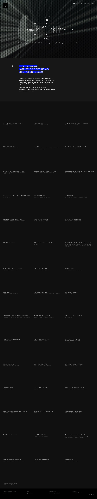

### 2.2 Harikalar
- **Şehir:** İstanbul (Şişli) + Çanakkale Teknopark Ar-Ge/üretim + Doha + ABD
- **Web:** https://harikalar.com
- **Uzmanlık:** Marka müzesi, deneyim merkezi, expo pavyonu, perakende deneyimi; anlatı tasarımı, mimari, projeksiyon mapping, AR/VR/MR, interaktif yüzeyler, **kendi üretim atölyesi + özel interaktif donanım + yazılım geliştirme + işletme** (tek çatı). "AI Video Booth", ziyaretçi analitiği.
- **Ödüller:** Stevie International Business Awards 2021 Gold + Bronze; Eventex Awards 2021 Global Winner; BEA World; 13. Doğrudan Pazarlama Ödülleri; **Kristal Elma 2025**: "Mastercard'la Karşı Karşıya" (McCann ile) Bronz Teknoloji Projeleri + Gümüş Ev Dışı Medya.
- **İşler:** Trendyol Maslak Kampüs deneyim alanları, Göztepe SK Müzesi, KAHRAMAA Water Awareness Park / Dana Dome Planetaryum (Doha), İST Marina interaktif akvaryum; THY, Tofaş, VakıfBank, Borusan, Eczacıbaşı, Ülker, Tüpraş. 40+ deneyim alanı, 3.5M+ ziyaretçi, 200+ marka.
- **Ekip:** 11-50 (LinkedIn); kuruluş 2006

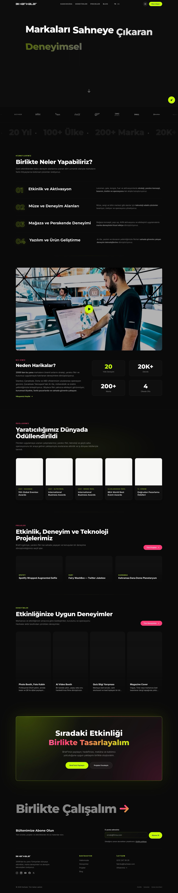

### 2.3 Nohlab
- **Şehir:** İstanbul (Beşiktaş)
- **Web:** https://nohlab.com
- **Uzmanlık:** Site-specific enstalasyon, projeksiyon mapping, A/V performans, deneyim tasarımı, gerçek zamanlı görsel sistemler, özel interaktif yazılım + projeksiyon/donanım kurulumu.
- **Ödüller:** Prix Ars Electronica Honorary Mention, Japan Media Arts Festival Jury Selection, Immersive Art Festival (yıl/kategori doğrulanamadı). Kristal Elma 2019-20'de "Arkhe" ile Deneyim Partneri (ödül olarak doğrulanamadı).
- **İşler:** "Arkhe" (DECOL ile, Siemens, Contemporary Istanbul 2019); Atelier des Lumières; World Government Summit "Edge of Government"; Land Rover, Chanel, Audi, Nike, Pink Floyd; Milan Design Week, Sónar.
- **Ekip:** 11-50 (LinkedIn); kuruluş 2011, Candaş Şişman & Deniz Kader

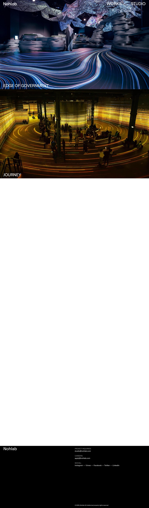

### 2.4 Project Istanbul
- **Şehir:** İstanbul (Maslak)
- **Web:** https://projectistanbul.com
- **Uzmanlık:** Video mapping (iç/dış mekân), immersive sergi, interaktif çözümler, temalı eğlence, VR deneyimleri, teknik süpervizyon.
- **Ödüller:** MUSE Creative Awards Platinum, "Experiential & Immersive Project" (Şerefiye Sarnıcı 360° mapping, 2021). Celsus Kütüphanesi mapping'i MUSE 2026 Platinum (yalnızca LinkedIn'de görüldü).
- **İşler:** Şerefiye Sarnıcı 360° mapping (İBB Kültür AŞ), Efes Celsus Kütüphanesi mapping, Özbekistan Devlet Tarih Müzesi immersive alanı.
- **Ekip:** 11-50 (LinkedIn 22; sitede 12 kişi listeli); kuruluş 2009

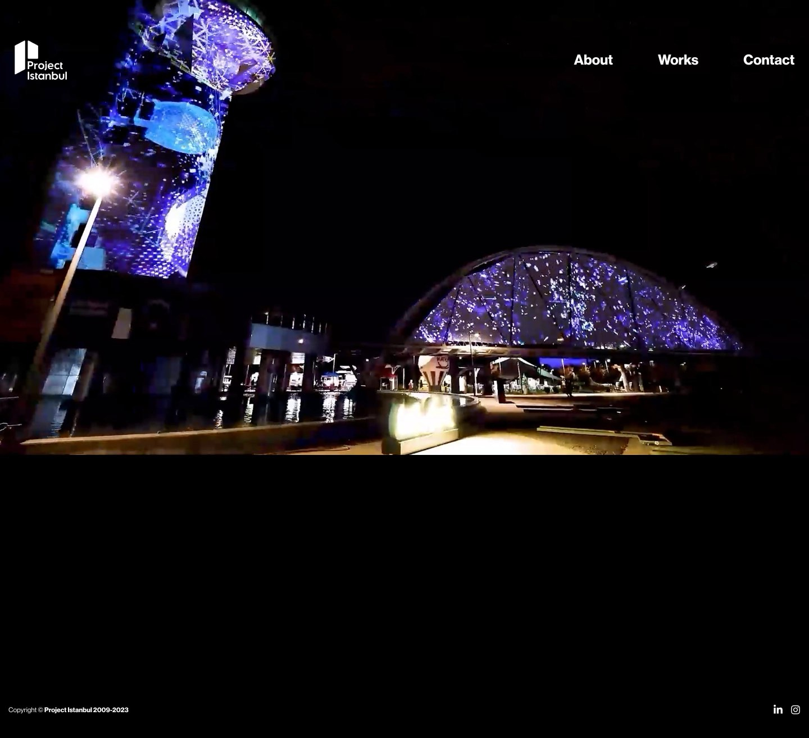

### 2.5 REO-TEK
- **Şehir:** Ankara (ODTÜ Teknokent)
- **Web:** https://www.reo-tek.com
- **Uzmanlık:** İnteraktif müze/sergi üniteleri, VR cerrahi eğitim yazılımı; tasarım + yazılım + üretim tamamı şirket içi. AI özellikleri (sürü davranışlı sanal balık vb.).
- **Ödüller:** Müzecilikte yeni teknolojiler üzerine TÜBİTAK projesi (destek). Ödül doğrulanamadı.
- **İşler:** ~40 müze tasarımı; Cermodern sergi alanı.
- **Ekip:** Mimar, iç mimar, bilgisayar müh., grafik tasarımcı karma ekip; sayı doğrulanamadı; kuruluş 2005

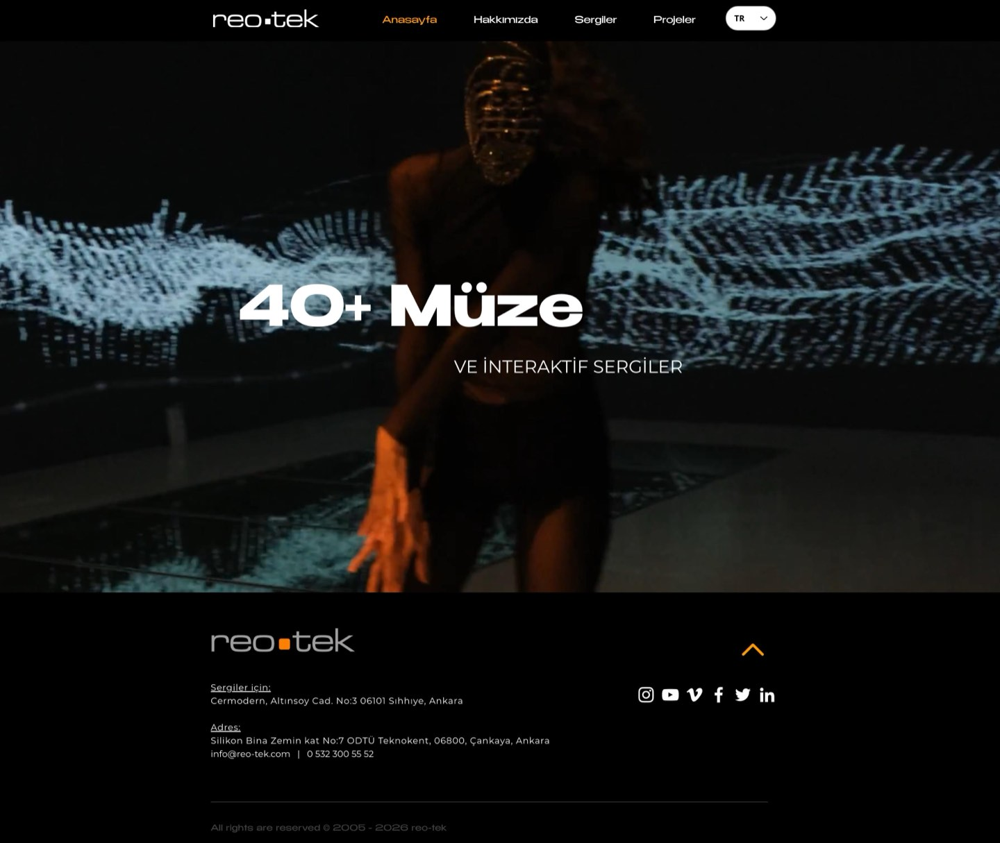

### 2.6 Dem Müzecilik (DEM Museums)
- **Şehir:** İstanbul (projeler İzmir, Denizli)
- **Web:** demmuseums.com (yalnızca başlık döndü; ekran görüntüsü alınamadı)
- **Uzmanlık:** Müze konsept/küratöryel tasarım, mimari, projeksiyon mapping, AR/VR/MR, interaktif dijital enstalasyon, AI tabanlı dijital restorasyon, ziyaretçi operasyonu.
- **Ödüller:** MUSE Creative Awards 2024: Efes Deneyim Müzesi Gold (Hologram/Projection); Ayasofya Tarih ve Deneyim Müzesi 2x Gold (Exhibition Experience + AR) [Euronews 9.9.2024]; Mondo-Dr Awards; Arival Spotlight 2024.
- **İşler:** Ayasofya Tarih ve Deneyim Müzesi, Efes Deneyim Müzesi, Hierapolis Deneyim Müzesi.
- **Ekip:** doğrulanamadı; kuruluş 2023

### 2.7 Codemodeon
- **Şehir:** İstanbul
- **Web:** https://codemodeon.com
- **Uzmanlık:** VR/AR/XR geliştirme, interaktif enstalasyon, marka oyunları, 360° interaktif video, IoT, SparkAR, kurumsal eğitim VR.
- **Ödüller:** "Header Goal VR – Best VR Game" (hangi ödül/yıl doğrulanamadı); Endeavor ScaleUp 2019.
- **İşler:** Mercedes AMG GT Configurator VR, Turkcell Kopilot Connected Car VR, Fox TV interaktif 360° video; Nestlé, Unilever, THY, Vodafone, Garanti BBVA.
- **Ekip:** 11-50 (LinkedIn); kurucu Yağız Hatay

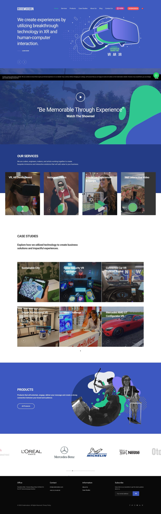

### 2.8 Antilop
- **Şehir:** İstanbul (Beyoğlu)
- **Web:** https://antilop.co
- **Uzmanlık:** Projeksiyon mapping, interaktif enstalasyon (multitouch, araç konfigüratörü), immersive tünel, holografik defile, AR, A/V performans.
- **Ödüller:** doğrulanamadı.
- **İşler:** Samsung "The Box" 360°, VW Passat Car Configurator, Coca-Cola 125. Yıl sergisi, NYFW "Digital Couture", Marmara Park roket mapping; BMW, Nike, Galatasaray.
- **Ekip:** 2-10 (LinkedIn); kuruluş 2010; kurucular arasında Refik Anadol (Bigumigu)

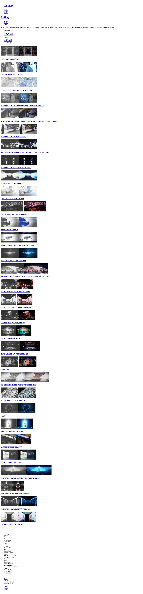

### 2.9 Diğer deneyim stüdyoları (kısa)
- **DECOL** (İstanbul): Türkiye'nin ilk yeni medya sanat kooperatifi (2014); interaktif sanat, Web3/3D (OMNEA). Ödül doğrulanamadı.
- **Fikirbaz Zenger** (İstanbul): Marka deneyim ajansı; Kapadokya Zelve mapping, Vodafone "Dare to Dream". Site doğrulanamadı.
- **Kibrit Creative Solutions:** 16K'ya kadar projeksiyon mapping; site SSL süresi dolmuş.
- **Enüstkat Interactive** (İstanbul): 2014'ten beri AR/VR ve sensör yazılımı; güncel site web/mobil ağırlıklı; Koç Holding, Vestel, Ford Otosan.

### 2.10 Kristal Elma'da öne çıkan "ajans + teknoloji ortağı" ikilileri
| Yıl | Kategori | Proje | Ajans | Teknoloji ortağı | Derece |
|---|---|---|---|---|---|
| 2025 | Etkileşimli Açıkhava; Teknoloji Projeleri; UI&UX | Teknosa "101. Yıl Anıtkabir Deneyimi" | Ogilvy 4129 | **Kodegon** | Gümüş, Gümüş, Kristal |
| 2025 | Enstalasyon & Etkinlik | CarrefourSA "Hayalet Ağlar" | TBWA\Istanbul | Organic Film, Sinefekt | Kristal + Büyük Ödül |
| 2025 | Enstalasyon & Etkinlik | Netflix "Squid Game Pink Guard'lar Metroda" | Tribal Worldwide | **Capsule Works** | Bronz |
| 2023 | Enstalasyon & Etkinlik | Mastercard "Şampiyonlar Ligi Vapuru" | Kompüter | **Jaguar Projects** | Kristal + Büyük Ödül |
| 2020 | Dijital Enstalasyon; En Yenilikçi Teknoloji | Asus "Ozmoz Dijital Sergi Oyunu" | Salvo | **fam°** | Kristal, Kristal, Bronz |

---

## 3. Türkiye: Dijital Ürün / Yazılım + Tasarım Ajansları

### 3.1 Commencis
- **Şehir:** İstanbul (+Ankara, İzmir, Berlin, Londra)
- **Web:** https://commencis.com
- **Uzmanlık:** Strateji + deneyim tasarımı (UX/UI), yazılım mühendisliği, mobil, AWS bulut, AI Lab/AI Studio, ürün yönetimi, QA. Tam uçtan uca dijital ürün. Donanım/IoT: doğrulanamadı.
- **Ödüller:** Altın Örümcek 2024 (22.) ve 2025 (23.) Yılın En İyi Mobil Uygulaması (Pegasus Mobil, resmî sonuç); UX Design Awards 2024 & 2025 Product (İşCep); Global Finance 2025 "World's Best Banking App" (İşCep); ARF Awards 2025 AI Award of the Year; AWS Consulting Partner of the Year TR 2024; TR Customer Experience Awards 2025 Best UX.
- **İşler:** İşCep (İş Bankası), Pegasus Mobil, Burgan ON, Turkcell, MetLife, Riyad Bank.
- **Ekip:** 450+ (site); Clutch 250-999

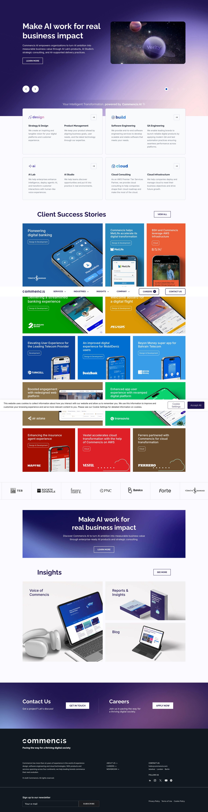

### 3.2 Super Agency
- **Şehir:** İstanbul (Levent) + Frankfurt
- **Web:** https://super-agency.com
- **Uzmanlık:** Dijital strateji, deneyim tasarımı, marka/design system, motion, enterprise engineering (Umbraco, WordPress, CRM/ERP entegrasyon), AI-ready architecture, SEO. Donanım/IoT: yok.
- **Ödüller:** **Awwwards Honorable Mention x14** (Türkiye'nin en ödüllü Awwwards profili: Siemens Mobility 2014, Doğuş 2016, Galataport/İstinyepark 2020, NORMIE/Sirkhet 2022, Equine Design 2025, Solino 2025/26); Altın Örümcek 2020-2025 çok sayıda, 2025 Kreatif Ajans 2.; "100+ ödül" (beyan).
- **İşler:** Galataport İstanbul, İstinyepark, Doğan Holding, Yıldız Holding, Norm Holding, Sirena Yachts, Karel.
- **Ekip:** 16+ (site); ~2010-11 kuruluş
- Not: Clutch'taki "super-agency" profili İtalyan bir firmadır, karıştırmayın.

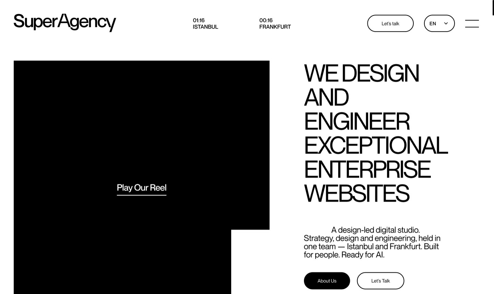

### 3.3 Istcode
- **Şehir:** İstanbul
- **Web:** https://istcode.com
- **Uzmanlık:** "360°" model: marka, kreatif prodüksiyon (CGI/3D, video), UI/UX, dijital pazarlama, yazılım (web, e-ticaret, mobil, **kiosk yazılımı**, özel çözüm), AI danışmanlığı, Shopify. Donanım/IoT: yok.
- **Ödüller:** Altın Örümcek 2025 AI & Teknoloji 1. (Roofstacks, resmî); Awwwards Honorable Mention x1 (doğrulandı); Altın Örümcek 2026 AI & Teknoloji 1., Horizon Interactive 2026 3 altın (beyan).
- **İşler:** Roofstacks, Ford Otosan, Türk Telekom, Liv Hospital, Medical Park, The Coffee Factory app, TURK Fatih Tutak.
- **Ekip:** doğrulanamadı; 10+ yıl

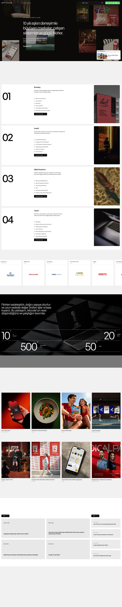

### 3.4 MadeByCat
- **Şehir:** İstanbul (+Cambridge, Dubai)
- **Web:** https://madebycat.com
- **Uzmanlık:** Kurumsal UX/UI, web geliştirme, CMS dönüşümü, design system, managed web. Mobil/AI belirtilmiyor.
- **Ödüller:** Altın Örümcek'te 88 ödül, "tarihinin 2. en ödüllü ajansı" (Altın Örümcek listesinde doğrulandı); Horizon Interactive 24, W3 12, Webby 3, Communicator 8 (beyan). Awwwards PRO profili.
- **İşler:** Global Ports Holding (30+ liman), Garanti BBVA API Market, Galataport, Koç Holding, TAV, Akbank, Çelebi Aviation, Memorial.
- **Ekip:** 21-30; kuruluş 2007

### 3.5 Pixelplus Interactive
- **Şehir:** İstanbul (Etiler + Maslak)
- **Web:** https://pixelplus.net
- **Uzmanlık:** UX/UI, web + mobil yazılım geliştirme, sosyal medya.
- **Ödüller:** Altın Örümcek 41+ (haber kaynaklı doğrulandı); Webby 6+, Stevie 24+, Deloitte 5+ (beyan).
- **İşler:** iyzico, Garanti BBVA, NTV.com.tr, VW binek araç sitesi, Türk Telekom Tivibu.
- **Ekip:** doğrulanamadı

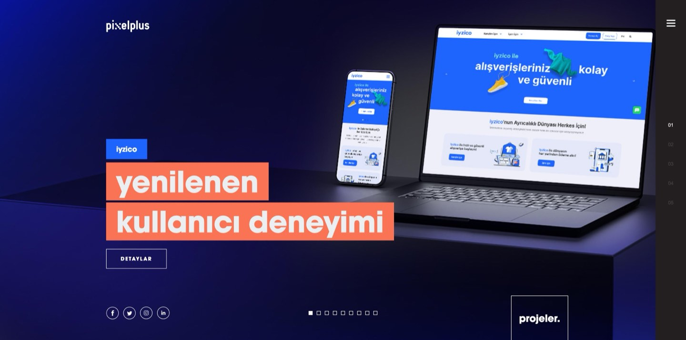

### 3.6 MagiClick Digital
- **Şehir:** İstanbul (+Londra, Dubai)
- **Web:** https://magiclick.com
- **Uzmanlık:** Teknoloji + tasarım; omni-channel bankacılık/e-ticaret platformları, UX, Umbraco Gold Partner.
- **Ödüller:** Altın Örümcek 2025 Bankacılık 1. (Akbank, resmî); Deloitte Fast 50 "10 kez" (beyan).
- **İşler:** Akbank, HSBC, QNB, Ziraat, IKEA, Domino's.
- **Ekip:** 180-200+ (LinkedIn; kesin sayı doğrulanamadı); kuruluş ~1996

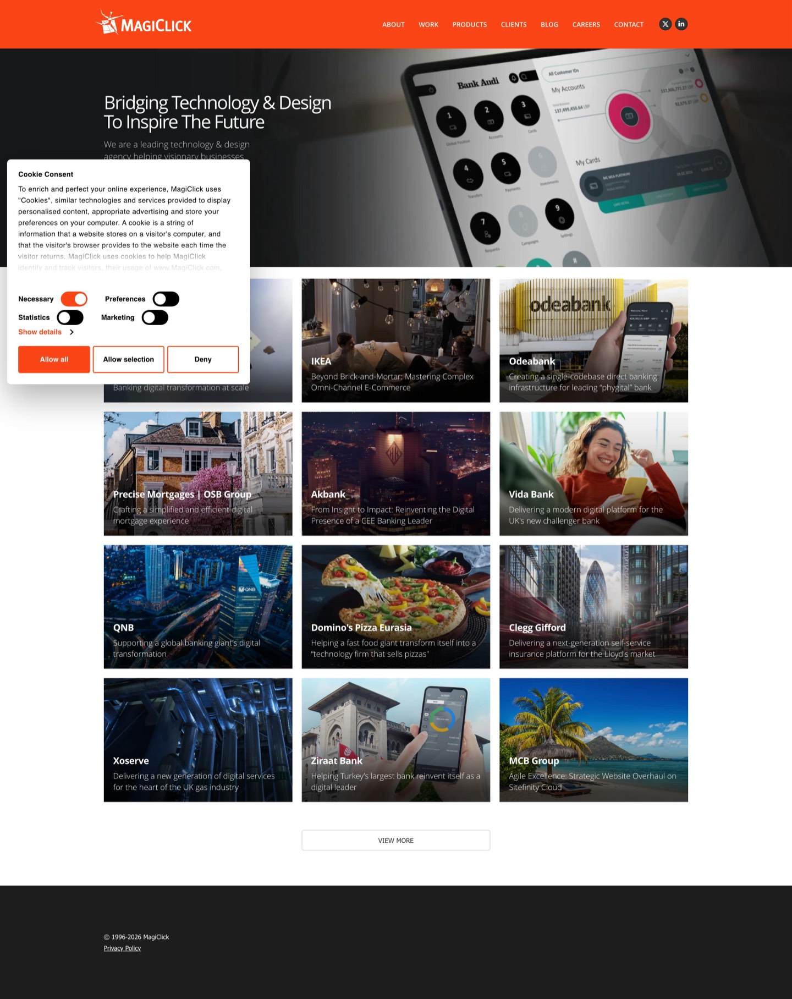

### 3.7 Clockwork Agency
- **Şehir:** İstanbul (Maslak)
- **Web:** https://clockwork.com.tr
- **Uzmanlık:** UI/UX, yazılım geliştirme (Umbraco Gold Partner), kreatif, sosyal medya; ISO 27001/12207.
- **Ödüller:** 128 ödül (site): Horizon Interactive 85 (2025'te 18 ödül, Distinguished Agency 2015/16/18/22/24/25), Altın Örümcek 17, Davey 9, IMA 14, W3 3.
- **İşler:** Turkcell 5G, Kuveyt Türk Portföy, QNB eSolutions, Alarko, Jeep/Alfa Romeo.
- **Ekip:** doğrulanamadı

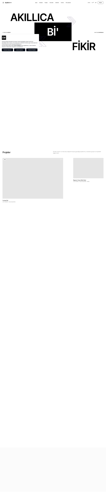

### 3.8 Scope Digital
- **Şehir:** İstanbul (Vadistanbul)
- **Web:** https://scope.digital (araştırma sırasında zaman aşımı; ekran görüntüsü alınamadı)
- **Uzmanlık:** Dijital strateji, marka, web + mobil tasarım/geliştirme, içerik, SEO, "AI visibility/GEO"; sağlık dikeyinde güçlü.
- **Ödüller:** Altın Örümcek 2025 Kreatif/Reklam Ajansı 1.; AI & Teknoloji 2. (Acıbadem Life) (resmî); Felis 2023, Istanbul Marketing Awards 2024-25, Golden Pulse 2025 (beyan).
- **İşler:** Acıbadem Life, Anadolu Sağlık, Sanofi, Medical Park, CCI.
- **Ekip:** doğrulanamadı; kuruluş ~2010

### 3.9 Atolye15
- **Şehir:** İzmir + Berlin
- **Web:** https://atolye15.com
- **Uzmanlık:** Ürün geliştirme (web, mobil, SaaS), UX/UI, AI-entegre çözümler, ekip takviyesi, "100-Day MVP".
- **Ödüller:** Clutch Global Fall 2023, Inc. Türkiye 100, Great Place to Work, AWS Partner (beyan); Clutch TR yazılım listesinde 13. (5.0).
- **İşler:** Mercedes-Benz StarMatch, Volvo Cars (8+ yıl, 24 pazar), Xbox, Peak Games.
- **Ekip:** 10-49 (Clutch); kuruluş ~2009

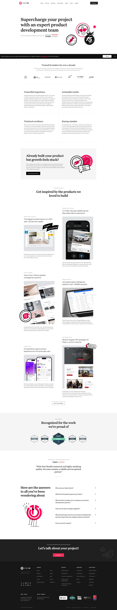

### 3.10 4A Labs
- **Şehir:** İstanbul, Ankara + Miami/LatAm
- **Web:** https://4alabs.io
- **Uzmanlık:** "AI-native" yazılım geliştirme, mobil, web, Web3, UI/UX, entegrasyon.
- **Ödüller:** Clutch TR yazılım listesi 9. sıra; ödül doğrulanamadı.
- **İşler:** Uber, Alibaba.com, Air Liquide, OYAK, CarrefourSA, Penti.
- **Ekip:** 50-249 (Clutch)

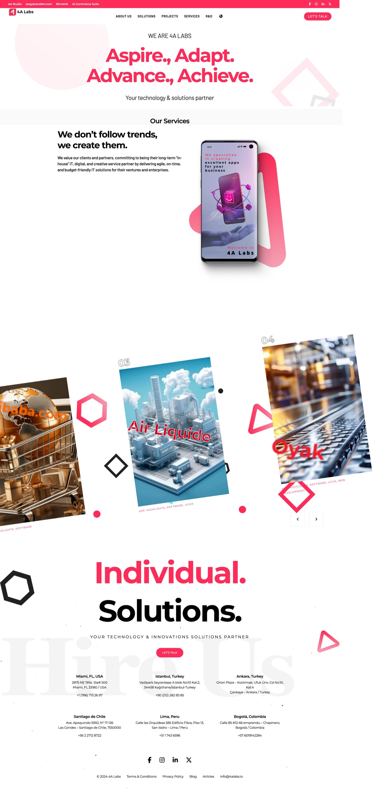

### 3.11 MediaClick
- **Şehir:** İstanbul + Manisa
- **Web:** https://mediaclick.com.tr
- **Uzmanlık:** Web tasarım/geliştirme, UI/UX, mobil (Flutter), yazılım.
- **Ödüller:** Altın Örümcek 2025 1. (HDI Fibabanka mobil app); Horizon 2024 Gold; "100+ ödül" (beyan).
- **İşler:** HDI Fibabanka, Kütahya Porselen, Museum Hotel.

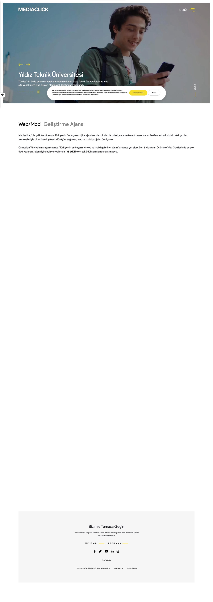

### 3.12 Brew (Brew Interactive)
- **Şehir:** İstanbul (Beşiktaş) + İzmir Teknopark/Urla
- **Web:** https://brewww.com
- **Uzmanlık:** UX/UI %25, özel yazılım %20, mobil %20, web %20, GenAI %15.
- **Ödüller:** Clutch 5.0 (21 yorum); Great Place to Work 2024.
- **İşler:** Škoda Türkiye, Volkswagen, Scania, Carrefour, Unilever, Hasbro, Aras Kargo, Bilyoner, Dubai Free Zone Council.
- **Ekip:** ~45; kuruluş 2009. Singapur'daki aynı adlı ajansla karıştırmayın.

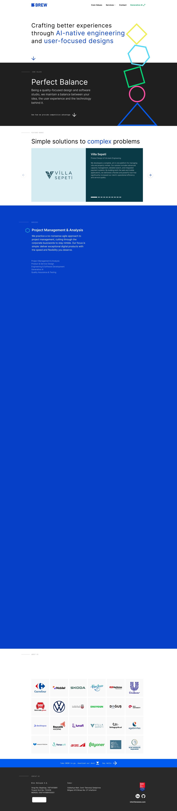

### 3.13 Diğer (kısa)
- **Wanda Digital** (Ogilvy/WPP, İstanbul): Full-service dijital; MIXX Awards TR Gold+Bronze 2014, Kristal Elma; 80+ kişi. Kampanya ağırlıklı.
- **Turkline** (İstanbul, 1997): UX research/test, UX writing, IA, UI; Altın Örümcek "Yılın Ajansı" x3, W3 Silver; TAV, Akbank, Biletix, Borusan CAT. Yazılım yapmıyor.
- **Penta Yazılım** (İstanbul/Kartal, 2003): Web tasarım + yazılım + mobil + dijital pazarlama; 50+ kişi; ödül doğrulanamadı; donanım yok. ("Kreatif Penta" karışıklığı için bkz. Bölüm 0.)
- **Mobven** (İstanbul): Kurumsal mobil (bankacılık/fintech); ING, DenizBank, Akbank; ödül doğrulanamadı.
- **Neon Apps** (İstanbul + New York): Clutch TR mobil listesi 1.; 85 kişi (beyan); ödül doğrulanamadı.
- **ZZG Tech** (İstanbul): MIXX Awards Türkiye 2025 "Yılın En İyisi" (THY "Fly By Sign"); konuşma ticareti teknoloji şirketi.
- **Naysworks** (İstanbul): MIXX 2025 Gold UX inovasyonu (Doritos Dolutos); aktivasyon ajansı.

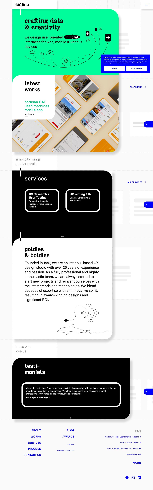
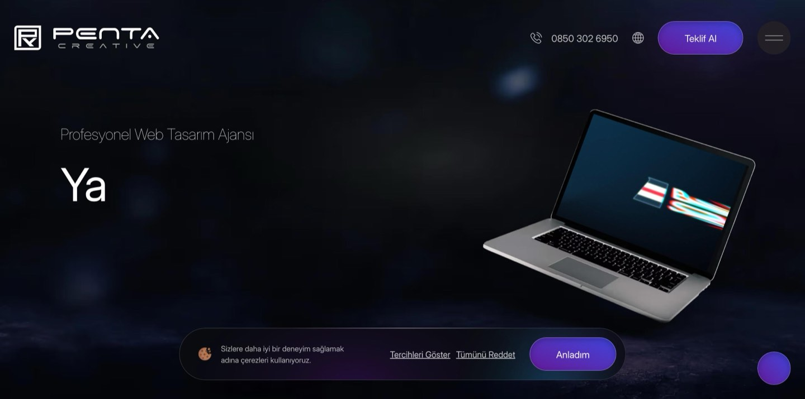

---

## 4. Butik UX / Ürün Tasarım Stüdyoları (ux.center ve benzerleri)

### 4.1 ux.center (User Experience Center Inc.)
- **Web:** https://ux.center (Framer)
- **Kurucu:** Sezer Yıldırım (sezer.website; eski: Doram Creative, Doktorsitesi, AHL Pay Lead Product Designer, Mobiliz)
- **Ekip:** Ana sayfada 4 isim (Sezer, Ufuk, Zach, Azade) → mikro-butik
- **Ofisler:** İstanbul 42 Maslak (Ahi Evran Cd.); Tiflis/Gürcistan (Techdev Office)
- **Kuruluş:** "yaklaşık 10 yıl" iddiası kurucunun kariyerine denk düşüyor; ux.center alan adı ve marka 2024'te yenilenmiş.
- **Hizmetler:** Design Systems, UI Design (atomic), UX Research, Animation/Interaction (Rive), Design Mentoring & DesignOps, Branding.
- **İşler:** ON Digital, AHL Pay (Featured Works; vaka içeriği yok).
- **Ödüller:** "We Are The Champions" bölümü var ama isim/yıl yok → doğrulanamadı. Clutch/Awwwards/Dribbble profili bulunamadı.
- **Değerlendirme:** Kurucu odaklı, 3-5 kişilik, Rive animasyon + design system vurgulu genç butik.

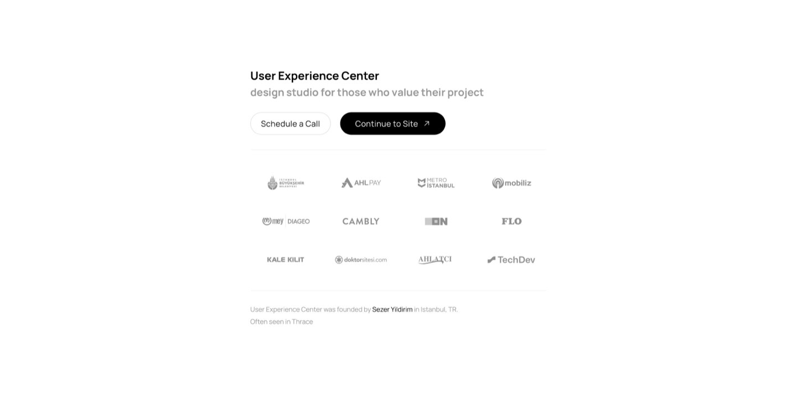

### 4.2 Benzer butik stüdyolar

| # | Stüdyo | Şehir | Web | Kuruluş | Ekip | Uzmanlık | Ödül / Tanınırlık | Öne çıkan iş | Yazılım/AI |
|---|---|---|---|---|---|---|---|---|---|
| 1 | **Fol** | İstanbul (Akaretler) | fol.com.tr | 2014, Volkan Ölmez | küçük | Marka + UI/UX + mobil/web + editoryal | Awwwards HM 2024, 2025 x2, 2026; FWA; Altın Örümcek x18 (2025, Yılın En İyi Web Sitesi); Graphis Gold 2026; European Design Awards 2014 | Getir, Tosla, Paribu Art, Turknet, IAB TR; İş Bankası, Arçelik, TAV, İKSV | Hayır |
| 2 | **blurple studio** | İstanbul + Barselona | blurple.digital | 2020/2022 | 10-49 | UX/UI, AI-native ürün, native mobil, LLM/copilot, B Corp (82.5) | Clutch 4.9, Top UX Agencies 2024 | ZES (700k+ sürücü), Yemeksepeti, Enjoy eSIM | **Evet** |
| 3 | **SHERPA** | İstanbul + Londra | sherpa.digital (TLS hatası) | 2013, Yakup Bayrak | 10-49 | %100 UX/UI, gömülü cihaz arayüzü (Arçelik/Beko/Grundig) | **Red Dot 2018 x3, iF 2019, Bronze Stevie 2019**; "Türkiye'nin ilk Red Dot'lu UX stüdyosu" | Arçelik HomeWhiz, Beko, Hepsiburada, İş Bankası, Paribu | Hayır. **Ocak 2022'de Paribu satın aldı**, dış müşteri alması belirsiz |
| 4 | **Spectailor** | İstanbul (Şişli) + Gebze | spectailor.co | 2019 | 2-9 | UX/UI %60, CRO, dijital strateji | Altın Örümcek 1. (Teknoloji), Horizon Best of Category (beyan); Clutch 5.0, $200-300/saat | Volvo Cars TR, SPI International, HRD Antwerp, Obilet, Şok | Hayır |
| 5 | **Bumu Digital** | İstanbul (Kolektif House Maslak) | bumu.digital | 2018 | 7 | UX/UI %60, ürün tasarımı, design sprint, fractional PM | Clutch 5.0 | Arçelik (Oliz), Borusan Lojistik, Anadolu Hayat, Paribu, DHL, Koçtaş | Hayır |
| 6 | **Lime or Lemon Studios** | İstanbul | limeorlemon.com | 2014 | 10-49 | UI/UX, mobil, web, AI geliştirme, motion | D&AD Yellow Pencil, Golden Drum, Altın Örümcek (beyan, doğrulanamadı) | Diageo TR, IWSA, Apaçık Radyo | **Evet** |
| 7 | **Userspots** | İstanbul | userspots.com | 2009, Mustafa Dalcı | ~25 | UX araştırma, UX/UI, Webflow, UX Okulu, UX Alive konferansı | Ödül bulunamadı; 800+ proje | X-cite (Kuveyt), Costa Coffee (Körfez), DenizBank, AXA, Teknosa | Kısmen |
| 8 | **Bakers Studio** (eski Hipo) | İstanbul | bakers.studio | Hipo 2010; 2023'te dönüştü | doğrulanamadı | Branding, web, ürün tasarımı, full-stack | Ödül yok | Pera Wallet, Tinyman, Giza, Stacker; çoğu uluslararası Web3 | **Evet** |
| 9 | **UXservices** | İstanbul | uxservices.com | ~2009 | doğrulanamadı | Kullanılabilirlik testi, design thinking, UXistanbul konferansı | European Software Testing Awards (yıl doğrulanamadı) | 400 proje, 20 ülke | Hayır |
| 10 | **Turkline** | İstanbul | turkline.com | 1997 | doğrulanamadı | UX research/test, UX writing, IA | Altın Örümcek Yılın Ajansı x3, W3 Silver, IMA | TAV, Akbank, Biletix, Borusan CAT | Hayır |

**Elenen/doğrulanamayan:** Kommunity (etkinlik platformu), Hipo (2023'te kapandı → Bakers), Gisele (giyim sitesi), Studio Nomad (boş), Kolektif Labs (522, muhtemelen kapalı), Tasarımhane (reklam ajansı), Tio (artık co-working), Doram Creative (alan adı satılık), ATÖLYE (artık Dubai merkezli).

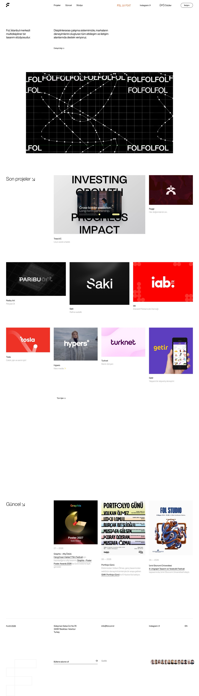
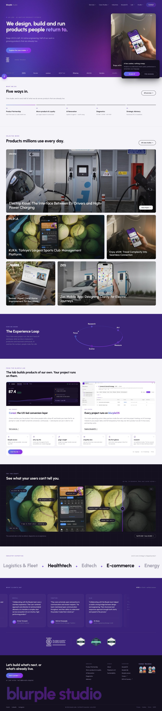
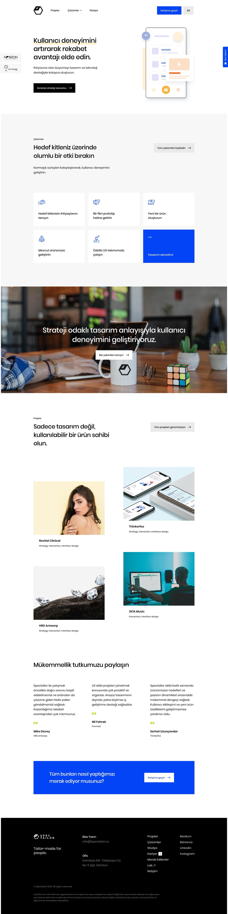
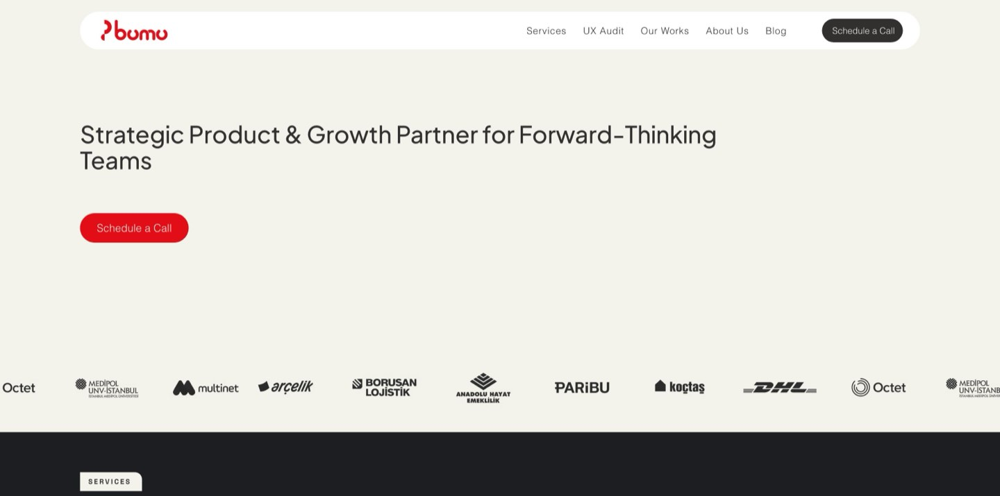
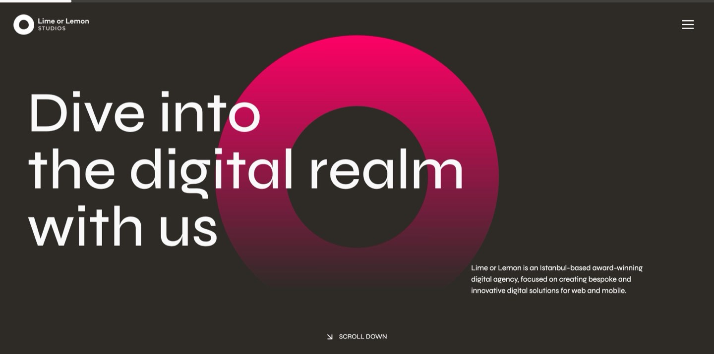

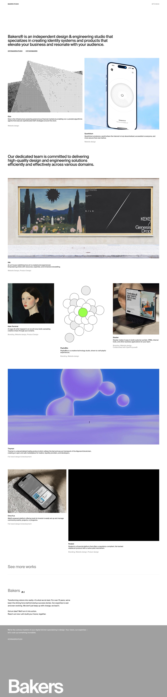

---

## 5. Türkiye: Yapay Zeka / Bilgisayarlı Görü Hizmet Evleri

| # | Ad | Şehir | Web | Uzmanlık | Ödüller / Destek | İşler | Ekip |
|---|---|---|---|---|---|---|---|
| 1 | **GTech** | İstanbul (+Ankara, Dubai) | gtech.com.tr | AI & veri mühendisliği, ileri analitik, fintech, generatif AI (Symphony Labs) | **Stevie IBA 2026: 1 Gold (Symphony Labs), 2 Silver, 1 Bronze**; Bilişim 500 | İş Bankası, Garanti BBVA, Akbank, Ziraat, VakıfBank, National Bank of Egypt | kurumsal ölçek |
| 2 | **Cerebrum Tech** | Ankara (Bilkent Cyberpark) + İstanbul; Silikon Vadisi, Seul, Londra | cerebrumtechnologies.com | NLP, bilgisayarlı görü, tahmine dayalı analitik, Cere Insight | NextRise Awards 2024 (Kore) "Overseas Innovator" (birincil kaynak doğrulanamadı); kurucu Fast Company TR "En Etkili 100 Dijital Lider 2025" | Eczacıbaşı, Bilkent Cyberpark; Microsoft, Samsung, Nestlé ortaklıkları | doğrulanamadı |
| 3 | **TUBU ARGE** | İstanbul (Teknopark İstanbul) | tubu.io | LLM ajanları/RAG, bilgisayarlı görü + VLM (kusur tespiti, edge), robotik, MLOps, blockchain | TÜBİTAK destekli Ar-Ge (destek) | Turkcell, Vodafone, TAB Gıda, Tekfen, EPİAŞ; 30+ kurumsal proje | doğrulanamadı; 2018 |
| 4 | **OpenZeka** | Ankara (Bilkent Cyberpark) | openzeka.com | NVIDIA Robotics TR/MEA distribütörü + AI hizmeti: akıllı görüntü analiz, yangın tespit, Cordatus, Omniverse dijital ikiz, edge AI kitleri | doğrulanamadı | iç projeler | doğrulanamadı; 2017 |
| 5 | **3Y Teknoloji** | Ankara (ODTÜ Teknokent) | 3yteknoloji.com.tr (403) | Kurumsal AI Ar-Ge: bilgisayarlı görü, görüntü işleme, LLM, ajan sistemleri | doğrulanamadı | doğrulanamadı | doğrulanamadı; 2012 |
| 6 | **Kuartis Teknoloji** | Ankara | SAHA İstanbul profili | AI/ML, bilgisayarlı görü, robotik, ISTAR, otonom araçlar | doğrulanamadı | doğrulanamadı | doğrulanamadı |
| 7 | **AYVOS** | İstanbul (Esenler) | ayvos.com | AI video analitik platformu (yüz tanıma, perakende, İSG, kalite kontrol) | doğrulanamadı | Unilever, Turkcell, Türk Telekom, İBB, Vavacars | 11-50 |
| 8 | **REM Vision Lab** (eski Udentify) | İstanbul | rempeople.com | Kamera tabanlı mağaza içi davranış analitiği, raf görüntü tanıma | doğrulanamadı | doğrulanamadı | REM People 201-500 |
| 9 | **Vispera** | İstanbul + Amsterdam, Londra, Chicago | vispera.co | Perakende raf görüntü tanıma (Storesense, Shelfsight) | doğrulanamadı | perakende/CPG | doğrulanamadı |
| 10 | **Opeak Vision** | İstanbul (Moda) | opeakvision.com | Endüstriyel kamera + AI model eğitimi + PLC entegrasyonu; 2-4 haftada devreye alma | doğrulanamadı | Cam üreticisi: 400 adet/dk, iade %85 azalma | doğrulanamadı |
| 11 | **Büyütech** | Ankara + Gebze + Ann Arbor | buyutech.com.tr | Kamera tabanlı algılama, görüntü işleme, kenar AI modülleri, araç kamera/sürücü izleme (ürün şirketi, OEM) | Sanayi Bak. "en iyi 3 teknoloji girişimi" 2013; KOSGEB/TÜBİTAK | Temsa iş birliği; Farplas yatırımı 2021; >800.000 kamera/yıl | doğrulanamadı |

**Kapsam dışı:** Intenseye (SaaS), Gamelight (ad-tech), ArtBizTech (eğitim), Bones Interactive (Web3/siber). Sabancı/Koç kurumsal inovasyon ödülüyle ilişkili bir ajans bulunamadı.

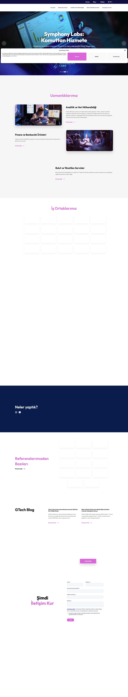
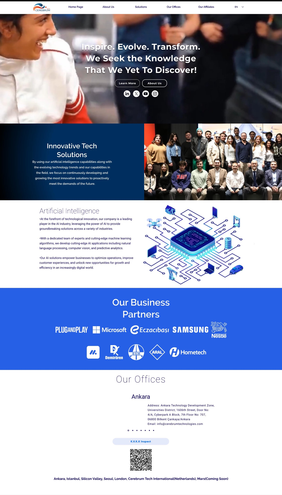
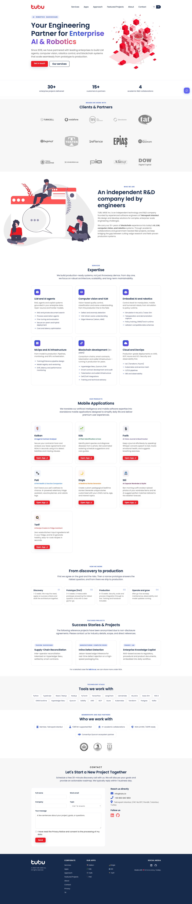
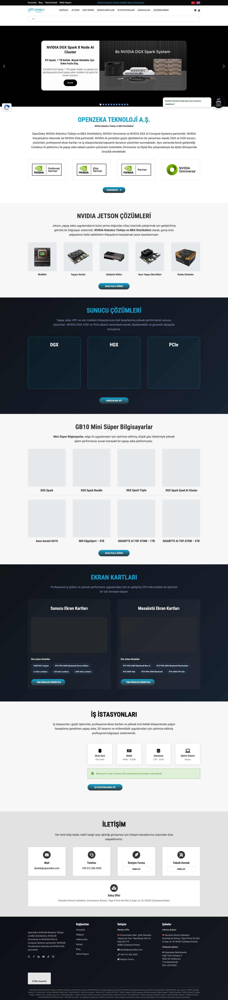
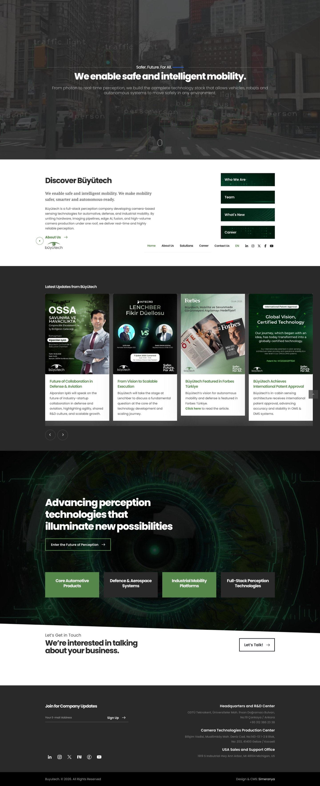

---

## 6. Türkiye: IoT / Gömülü Sistem / Endüstriyel Tasarım Stüdyoları

**Temel bulgu:** "Endüstriyel tasarım + elektronik + gömülü yazılım + UI" dördünü tek çatıda sunan VE Red Dot/iF/Design Turkey ödüllü stüdyo neredeyse yok. Piyasa (a) ödüllü endüstriyel tasarım ofisleri ve (b) ödülsüz elektronik/gömülü Ar-Ge evleri olarak ikiye ayrılıyor.

| # | Ad | Şehir | Web | Uzmanlık | Ödüller (doğrulanan) | İşler | Ekip |
|---|---|---|---|---|---|---|---|
| 1 | **Desird Tasarım Ar-Ge** | Antalya (Serbest Bölge + Ar-Ge Merkezi) | desird.com | Anahtar teslim elektronik: PCB/gömülü, motor sürücü, **IoT, RF, OTA**, yüksek sıcaklık elektroniği, SMD/THT üretim; ekipte endüstriyel tasarımcı var | Tasarım ödülü doğrulanamadı; TOBB En Hızlı Büyüyen 100 (5 yıl) | Asansör/metro/peron kapı kontrol kartları; 66 ülkeye ihracat | doğrulanamadı |
| 2 | **Innosys Ar-Ge Mühendislik** | Ankara (Kahramankazan), 2015 | innosys.com.tr | Endüstriyel tasarım + mekanik + elektronik (çok katmanlı PCB) + **gömülü yazılım** + prototip + çevresel test; savunma/havacılık ağırlıklı | doğrulanamadı | Uçuşa elverişli alt sistemler, özel test sistemleri | doğrulanamadı |
| 3 | **Kilit Taşı Tasarım** (Kunter Şekercioğlu) | İstanbul (Maslak) | kilittasi.com | Endüstriyel ürün tasarımı + strateji. Elektronik/yazılım yok | **German Design Award 2023/24/25 (Gold 2020), iF 2020, Good Design Japan 2020, Red Dot 2013, Design Turkey 2010-2021** | Arzum, Banat, Pirge, Scrikss, Stryker, Kütahya Porselen | doğrulanamadı |
| 4 | **Arman Tasarım** (Murat Armağan) | İstanbul (Anadolu Hisarı) | armantasarim.com | Endüstriyel tasarım, tasarım mühendisliği, prototip; "Elektronik" ve "Savunma/Güvenlik" kategorileri | **iF Design Award 2022 x3** (Redon BEST CNC, R-One Dental, Gentle Power); Good Design x4 (beyan) | THY, Türk Telekom, Turkcell, Eczacıbaşı, Havelsan, İBB | doğrulanamadı |
| 5 | **Kar Design** | İstanbul (Üsküdar) | kardesign.com.tr | Ürün tasarımı, mühendislik, üretim, **dijital tasarım (ürünle entegre arayüz)**; otomotiv, elektronik, savunma, medikal | **iF Design Award 2024**: "Türkiye'de en çok puan alan ödüllü tasarım ofisi" (Capital) | Servant AMR (otonom mobil robot), Enavision 120, Fibermak Gen-5 | doğrulanamadı |
| 6 | **PRODA Endüstriyel Tasarım** | Ankara (Ankara Teknopark), 2013 | prodatasarim.com.tr | Endüstriyel ürün tasarımı; "Elektronik" kategorisi | "Ulusal ve uluslararası birçok ödül" (ad/yıl doğrulanamadı) | Bozankaya, Temsa, Aselsan; havalimanı pist aydınlatması, medikal yataklar | 10+ tasarımcı |
| 7 | **Designnobis** (Dr. Hakan Gürsu) | Ankara | designnobis.com (404) | Endüstriyel tasarım, konsept/inovasyon | **A' Design Award**: Hakan Gürsu 77 ödülle Türkiye birincisi | Kendi konsept ürünleri | doğrulanamadı |
| 8 | **Ürün Atölyesi** | Türkiye | urunatolyesi.com.tr | Endüstriyel tasarım + prototip/üretim + UI/UX, "14 günde üretime" | doğrulanamadı | Startup odaklı | butik |
| 9 | **Tulga** | İstanbul (Ataşehir) | tulga.com.tr | Endüstriyel tasarım, mekanik, hızlı prototip, tersine mühendislik | doğrulanamadı | Anadolu Isuzu, Günsan, Bürotime; ~1.200 proje | doğrulanamadı |

**Pratik öneri:** Uçtan uca akıllı kamera/IoT ürünü için gerçekçi model "ödüllü endüstriyel tasarım ofisi (Kilit Taşı / Kar Design / Arman) + elektronik-gömülü Ar-Ge evi (Desird / Innosys)" konsorsiyumu.

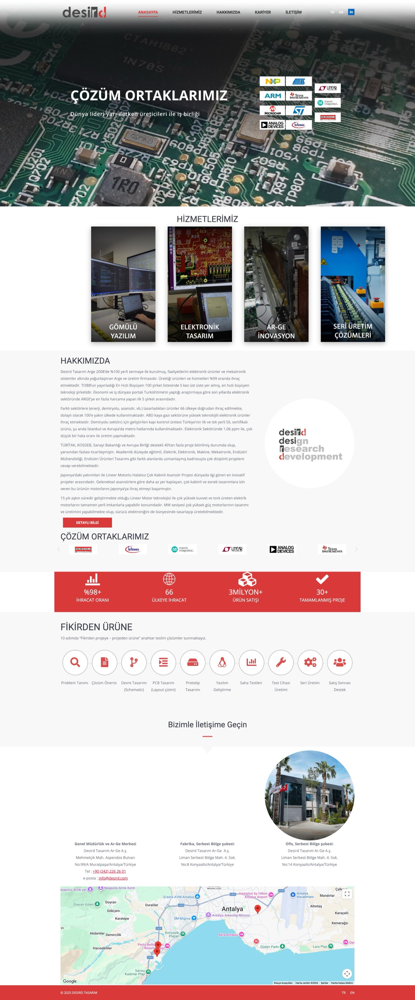
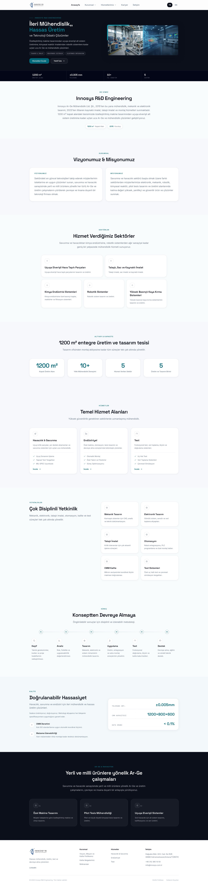
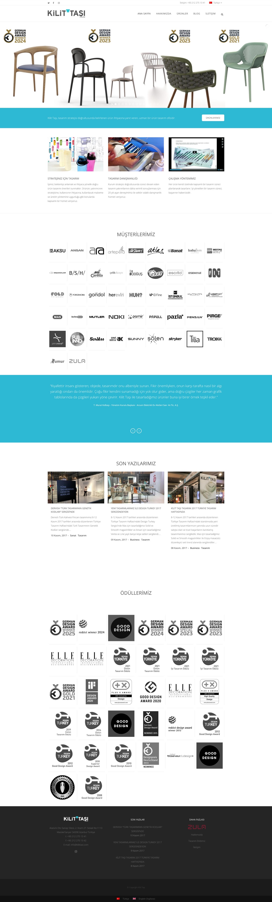
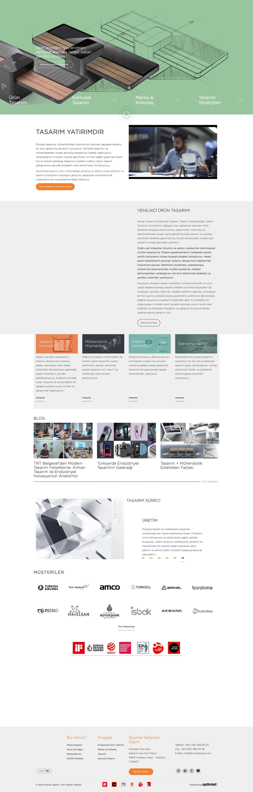
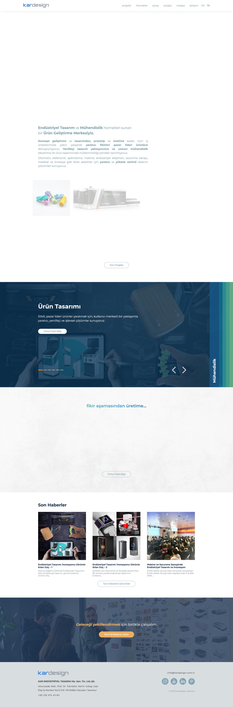
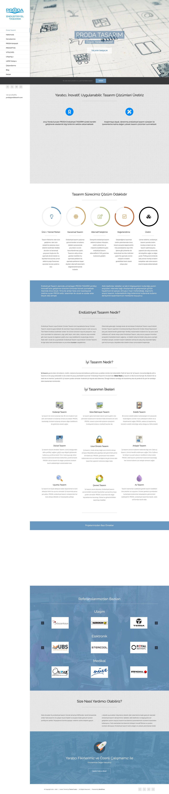

---

## 7. Türkiye: IoT + Güvenlik/Kamera Sistem Entegratörleri ("ajans gibi" uçtan uca)

Proje tasarımı + yazılım/AI + donanım seçimi + montaj + entegrasyonu birlikte yapanlar.

| # | Firma | Şehir | Web | Uzmanlık | Partnerlik | Ödüller | Projeler | Ekip |
|---|---|---|---|---|---|---|---|---|
| 1 | **Securitas Technology Türkiye** (eski Sensormatic, 1994) | İstanbul; 81 il | securitastechnology.com/tr-tr | CCTV, AI video analitik, erişim/biyometri, RFID/IoT varlık takibi, uzaktan izleme; tasarım+kurulum+bakım | Securitas grup | **Bilişim 500 2025: "Sistem Entegratörü – Güvenlik Kamera Donanımı" 1.; Türkiye'nin 18. büyük bilişim şirketi** | 5.000+ kurumsal müşteri, 40.000+ nokta | ~250 |
| 2 | **Bilge Güvenlik** (2003) | İstanbul (Ataşehir); Ankara, İzmir | bilgeguvenlik.com | IP video, video analitik + plaka tanıma, AI destekli IP video, İSG AI kamera, IP seslendirme; mühendislik + kurulum + bakım | **Milestone Premier Partner (2009'dan), Axis Gold Partner (2013'ten)**, Avigilon, Hanwha | **Axis Yılın Projesi 2024, Milestone GD Avrupa Yılın Partneri 2025** (beyan) | Ticaret Bakanlığı Sınır Kapıları IP Video; Elginkan Holding; İBB-İETT Metrobüs IP seslendirme | doğrulanamadı |
| 3 | **EEC Entegre Bina Kontrol** (40 yıl) | İstanbul; Ankara, Bursa, Ege; **Gaziantep**, Kayseri; Bakü | eec.com.tr | CCTV/VMS, erişim, yangın, anons, bina otomasyonu; tasarımdan anahtar teslim + bakım | **Milestone Premier Partner, 10 yetkinlik sertifikası ("Türkiye'de en fazla")**, ISO 9001 | doğrulanamadı | Garanti BBVA Pendik Kampüs, Şekerbank GM, Turkuvaz Medya, Bakü Tower, Dakar Arena | **130 kişi (37 müh., 54 tekniker)** |
| 4 | **ISSD** (2009) | Ankara (ODTÜ Teknokent) | issd.com.tr | Akıllı şehir/trafik kameraları, AI trafik analizi (VIERO-AI), plaka tanıma/EDS, sensör geliştirme (IoT), merkezi yönetim yazılımı, saha kurulum | Advantech, Dahua, Hikvision, Huawei, IBM, Intel, Turkcell, Türksat | doğrulanamadı | **Gaziantep 200+ adaptif kavşak**; Bursa, Konya; 5.000+ nokta, 80+ şehir, 20+ ülke | **120+** |
| 5 | **Ekin Smart City** (1998) | Türkiye (+Miami, Zürih, Stuttgart, Bakü) | ekin.com | Kendi AI kamera/akıllı direk (Spotter), ALPR, yüz tanıma, mobil devriye, Maestro OS; donanım+yazılım kendi üretimi | Patentler | **Red Dot (Box Spotter), iF Design, CES; "40+ uluslararası ödül"; Bilişim 500 2018 Yazılım İhracatı Şampiyonu; TİM 2017** | Zürih Polisi, Coral Gables (ABD) | doğrulanamadı |
| 6 | **İSBAK** (İBB iştiraki, 1986) | İstanbul | isbak.istanbul | Akıllı ulaşım, kamera sistemleri, AI, Ar-Ge merkezi | Ar-Ge Merkezi | **Bilişim 500 2026: "Görüntü ve Ses Sistemleri" + "Güvenlik Kamera Donanımı" 1.** | İstanbul trafik/kamera altyapısı | 1.001-5.000 |
| 7 | **Sensemore** | İstanbul | sensemore.io | Endüstriyel IoT titreşim sensörü donanımı + bulut + AI kestirimci bakım; saha kurulum | TT Ventures, MESS yatırımı | **TechSquare T-Day 2020 "Yılın Girişimi"** | Bosch, Siemens, Ford, Arçelik, Sanofi (27+) | doğrulanamadı |
| 8 | **VGS Grup** (1994) | Eskişehir | vgs.com.tr | Termal kamera + AI analitik + plaka/ERP entegrasyonu, yüz tanımalı turnike, termal depo yangın tespiti; master plan + kurulum + 7/24 izleme | Hikvision, Ajax, Dahua, Bosch | doğrulanamadı | Eskişehir/Bilecik OSB fabrikaları; 60+ tesis, 30+ hastane, 45+ otel | 22+ |
| 9 | **Movita** | Ankara | movita.com.tr | %100 yerli AI kamera (plaka, kişi sayma, bölge ihlali), araç NVR, DSM/ADAS, İSG/KKD AI, forklift 360° | TSE | doğrulanamadı | doğrulanamadı | doğrulanamadı |
| 10 | **BİSAVUNMA / HIKMICRO Türkiye** | İstanbul | hikmicroturkiye.com | Termal/bi-spektrum PTZ, radar, drone tespit/anti-drone, AI hedef tespiti; projelendirme + saha | HIKMICRO | doğrulanamadı | Sınır/kritik tesis | doğrulanamadı |
| 11 | **Nanotek Yazılım** | İstanbul (Ataşehir) | nanotekyazilim.com | IP CCTV, Milestone VMS, AI davranış analizi, plaka tanıma, biyometrik geçiş | Milestone, Hanwha, Mobotix, Huawei | doğrulanamadı | Konya BB, TCDD, İSKİ, Kocaeli BB | doğrulanamadı |
| 12 | **Rima Elektronik** (2000) | İstanbul (Florya) | rimaelektronik.com | IP CCTV + VMS (Milestone, Digifort), AI analitik, siber güvenlik, ERP-CRM | Axis, Dahua, Hikvision, Cisco, IBM | doğrulanamadı | 600+ müşteri, 1.000+ proje, 10+ ülke | doğrulanamadı |
| 13 | **Odak Güvenlik / TİSİ** | İstanbul (Şişli) | odakguvenlik.com | Axis IP/termal/panoramik kamera, VMS + analitik, iş zekâsı, trafik optimizasyonu | **Axis Gold Partner** | doğrulanamadı | Hyundai Mobis, Ford, Shell, Goodyear, Turkish Technic, Ferrero, Dream Games | doğrulanamadı |
| 14 | **Next AI Teknoloji** | Çorlu/Tekirdağ | nexadepo.com | CCTV/IP, ağ, erişim, akıllı bina; tasarım + tedarik + kurulum + 7/24 | 46+ marka | doğrulanamadı | İstanbul Havalimanı 1.200+ IP kamera (beyan) | doğrulanamadı |

**Not:** Perakende analitiği yazılımcıları (Ayvos, REM Vision Lab, Vispera) saha montajını entegratör partnerlere bırakıyor; uçtan uca için entegratör + analitik yazılımcı eşleştirmesi gerekebilir.

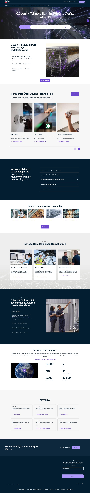
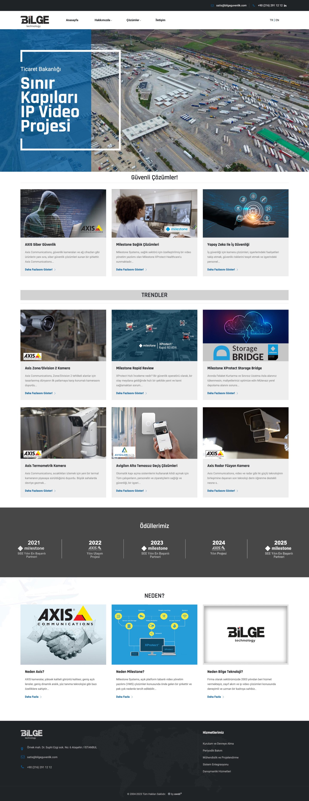
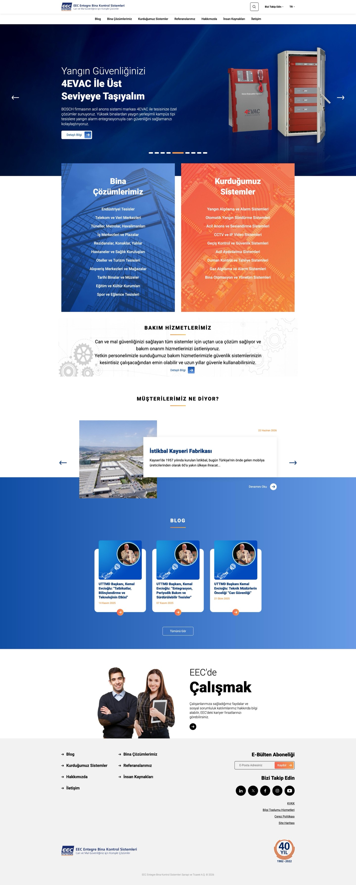
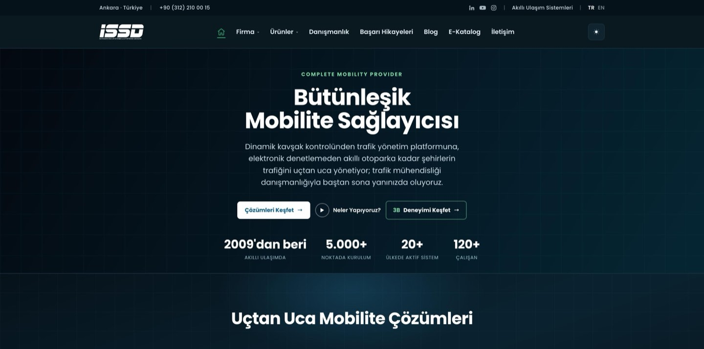
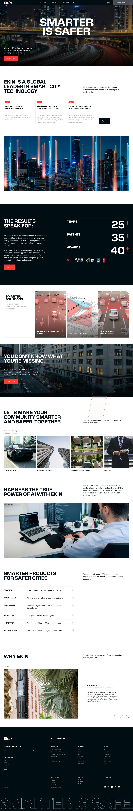
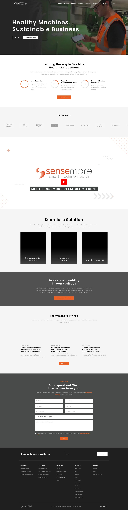
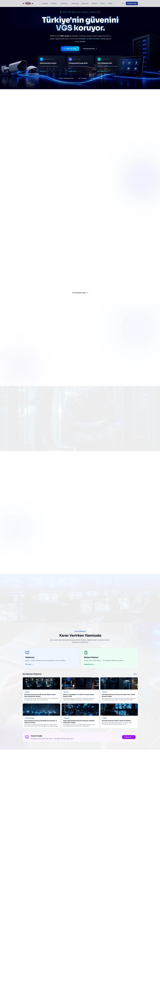

---

## 8. Gaziantep

**Genel bulgu:** Kristal Elma 2023/2025, Altın Örümcek 2023-2025, Felis, MIXX, Awwwards, Red Dot listelerinde Gaziantep merkezli hiçbir ajans yok. Tek ulusal ödül izi: Antebella (Antepsan) web sitesi, Altın Örümcek 2022 Yiyecek & İçecek 1. (ajansı Ankara/İstanbul merkezli Ket Kolektif). Deloitte Fast 50, Bilişim 500, Teknofest'te firma bazlı Gaziantep kaydı doğrulanamadı. GTO/GSO'nun ajanslara ödül programı yok.

### 8.1 Tasarım / Kreatif / Dijital Ajanslar

| # | Ajans | İlçe | Web | Uzmanlık | Ödül | Müşteri | Ekip |
|---|---|---|---|---|---|---|---|
| 1 | **MVM Ajans & Studio** | 5. OSB, Şehitkamil | mvmajans.com | Creative / Design / Production / Growth / **AI System + AI LAB** (kendi AI motoru, hibrit prodüksiyon), stüdyo | Bulunamadı | Sitede müşteri listesi yok | doğrulanamadı |
| 2 | **Xloop Interactive** | Gaziantep Teknopark, Şahinbey | xloopinteractive.com | 3D harita tabanlı sunum (Metropolis, ArchShow, PresentX), **AR/VR, dokunmatik/videowall, dijital ikiz (Mechanix), 3D İSG simülasyonu** | Bulunamadı (MIPIM Cannes katılımı) | Gaziantep, Hatay, Antalya, Bursa, Kocaeli BB; Akçansa | 2-10; 2014 |
| 3 | **Kaktüs Creative / Kaktüs Medya** | İncilipınar, Şehitkamil | kaktusmedya.com | Web/UX, KK, sosyal medya, video, 3D, **özel yazılım (Sirius CRM, Kaktüs Jet e-ticaret, Haber Sihirbazı), mobil** | Bulunamadı | Şehitkamil Bel., Pazarcık Bel., İSTE; 648+ proje | 7+; 2013 |
| 4 | **342 Ajans** | Mücahitler, Şehitkamil | 342ajans.com | Açıkhava & medya, **yazılım (web/mobil)**, tasarım, **prodüksiyon (tanıtım filmi, 360° sanal tur, drone)**, performans | Bulunamadı | Turkcell, Toyota, Deva Hastanesi | 11-50 |
| 5 | **Vemedya** | Gaziantep Teknopark | vemedya.com | Web tasarım, web yazılım, mobil, e-ticaret (Baskingo), oda yazılımı (Chamber360), hosting | Bulunamadı | GTO, GSO, SANKO Hastanesi, İŞKUR; 560+ proje | 2-10; 2000 |
| 6 | **Develcodex** | Değirmiçem, Şehitkamil | develcodex.com | Kurumsal web, e-ticaret, özel yazılım, iOS/Android, KK, SEO, Ads | Google/Meta Partner | 1400+ proje | doğrulanamadı; 2014 |
| 7 | **Fikir Sanat Medya** | Şehitkamil | fikirsanatmedya.com.tr | "Görsel dil stüdyosu": marka, ambalaj, web, mobil (Flutter), baskı | Bulunamadı | Vaka çalışmaları (isim yok) | doğrulanamadı; 2018 |
| 8 | **Ravo Creative** | İslahiye & Gaziantep | ravocreative.com | KK, web, e-ticaret, video & 3D, sosyal medya, yazılım & mobil | Bulunamadı | Big Chefs, Biberhan, Kanaat Plaza, Tilmen Group; 800+ proje | doğrulanamadı |
| 9 | **Teknografi** | İncilipınar, Şehitkamil | teknografi.net | KK, web, fuar standı, dijital marka | Eski sitede "Webby 2020 / CSSDA 2018" ibaresi, **tema şablon metni olduğu anlaşıldı, doğrulanamadı** | Zimed Medikal, Karan Yapı, Sedat Akdoğan Koleji | 2-10; 2014 |
| 10 | **İxirli Reklam & Prodüksiyon** | Gaziantep | ixirli.com | Video/tanıtım filmi, drone, Reels, sosyal medya, web | Bulunamadı | Arçelik, Bosch, 29 Mayıs Okulları; "42M+ izlenme" | doğrulanamadı; 2018 |
| 11 | Derin Fikirler, Adres Ajans, Cool Media (5 kişi), Divays Medya, Var Ajans, DRN Digital (GBB, HKÜ), YTASoft, Kodibu, HR Ajans (drone/360°/3D haritalama), Anatol Media, 2Medya | çeşitli | — | Klasik reklam/web/prodüksiyon | Bulunamadı | — | 2-10 |

**Elenenler (Gaziantep merkezli değil):** Ahtapot (45 kişi), Brandaft, Vantaworks, Makrops, Dijicrea, FRANK., Hoops, WOM (İstanbul); Andalus Media (alan adı park); Regortech (İstanbul).

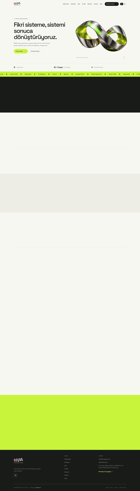
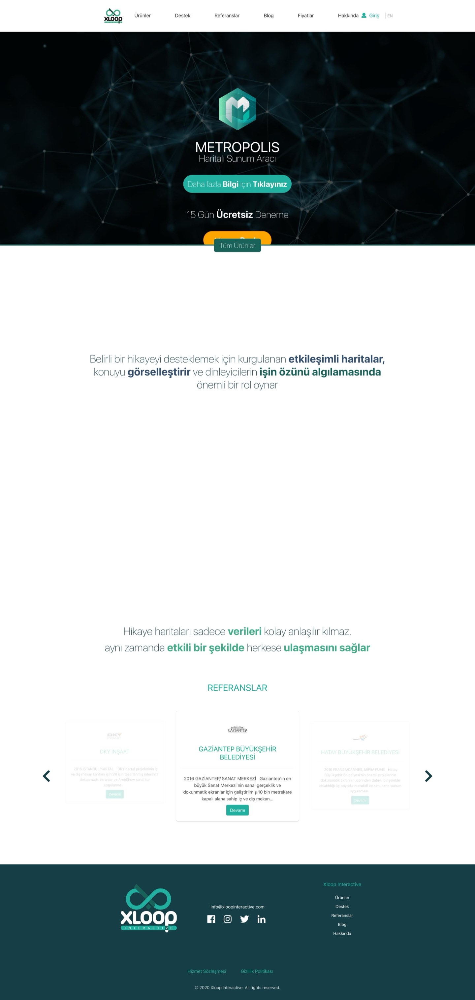
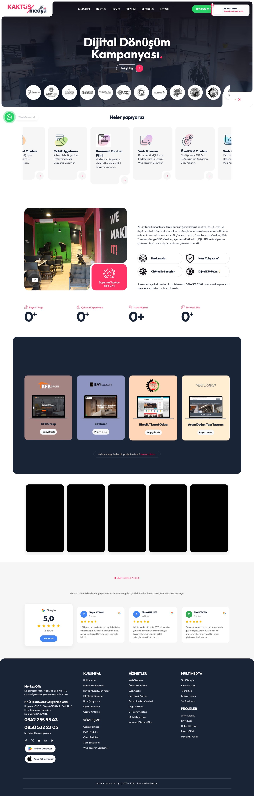

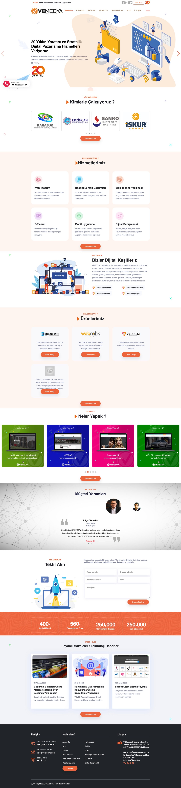
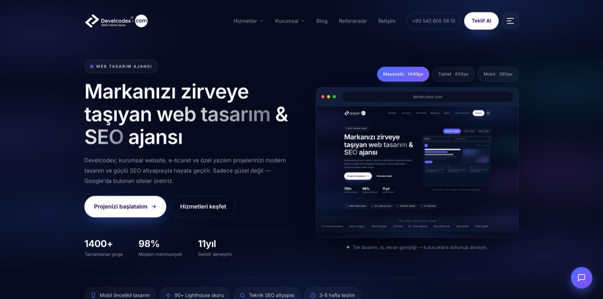
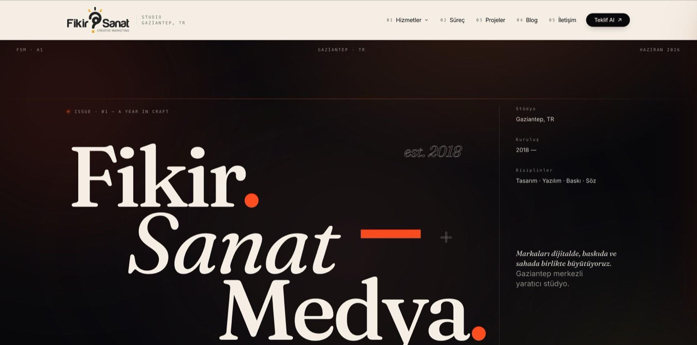
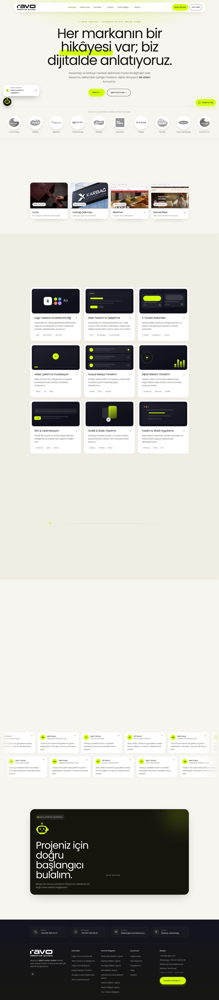
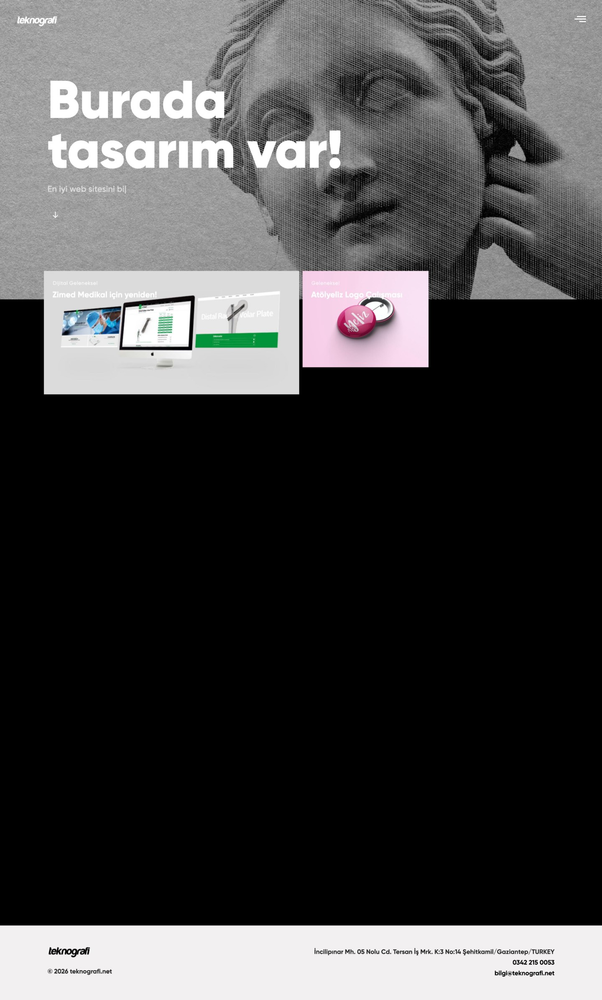

### 8.2 Yazılım / Yapay Zeka / Görüntü İşleme

| # | Firma | Konum | Web | Uzmanlık | Ödül / Destek | İşler | Ekip |
|---|---|---|---|---|---|---|---|
| 1 | **Piksel Analitik** | GAÜN Teknopark A Blok K2 No:216 | pikselanalitik.com | Endüstriyel AI + bilgisayarlı görü (YOLO/OpenCV, Jetson edge), PLC/IoT/Modbus, üretim takip, dijital ikiz, ERP/web/mobil | doğrulanamadı | **PXL-CORE**, **LineGuard** (un fabrikası AI sevkiyat takibi, Özbal Un) | doğrulanamadı; kurucular Mehmet Durmaz, Mustafa Özbal |
| 2 | **Yncsoft (SmartCovis)** | GAÜN Teknopark 4/A No:109 (+İzmir DEPARK) | yncsoft.com, smartcovis.com | **Yapay görme**: yüzey/PCB/etiket/solar hücre denetimi, 3D yüzey ölçümü; karar destek, BI, özel yazılım | doğrulanamadı | "Türkiye ve komşu ülkelerde üretim sahalarında" (müşteri adı yok) | doğrulanamadı; 2009 |
| 3 | **appVentures** | GAÜN Teknopark | appventures.com.tr | AI/ML, IoT, robotik (ROS/PLC), Endüstri 4.0, SCADA/Grafana, mobil, web/SaaS, **gömülü sistem tasarımı** | doğrulanamadı; ortaklar GAÜN, TARGET TTO, AirLab | XTrack (GES izleme), Ventur GO; Asya Feed, Tülücü Tekstil, Patentist | **5 kişi**, 50+ proje; 2020 |
| 4 | **AIRLAB Teknoloji** | GAÜN Teknopark 4/C | airlab.com.tr | Endüstriyel IoT sensör kutuları, AI analitik, GES kestirimci bakım (AIRSOL), dijital ikiz | **Horizon Europe Seal of Excellence (05/2026), Technoventure Badge (10/2025)**, TÜBİTAK ARDEB | AIRSOL, 3D-SENSOREUSE | "50+" (beyan, akademik) |
| 5 | **İremSoft (İrem Yazılım Otomasyon)** | Şehitkamil + Teknopark 4/A; 2001 | iremsoft.com | Makine üreticileri için PLC/PC otomasyon; **yapay görme (0,01 mm ölçüm, OCR, yüzey kontrol, 2D/3D)**; **Staubli/Bonas/Grosse jakar kontrol kartı** (halı tezgahları, uzaktan desen); halı kesim makineleri; ERP AI | doğrulanamadı | 70+ referans (yurt içi/dışı) | doğrulanamadı |
| 6 | **BizYaz Bilişim** | Gaziantep | bizyaz.com | İş zekâsı, büyük veri, özel yazılım; HL7, KliniQ, BYPLM (hazır giyim PLM), Biz Fashion (sanal deneme) | doğrulanamadı | ürünler | doğrulanamadı |
| 7 | **Kodlio Yazılım** | GAÜN Teknopark A Blok K1 No:106 | kodlio.com.tr | Modüler ERP, MRP, CRM, POS, mobil, e-Fatura | doğrulanamadı | MHK Medikal Tekstil, Hanedan, Göral Kuruyemiş | doğrulanamadı |
| 8 | **Sistem Yazılım** | GAÜN Teknopark A Blok 202 | sistemyazilim.com.tr | caniasERP iş ortağı, IAS AI iş zekâsı, sektörel ERP (halı, un, makine, ambalaj) | doğrulanamadı | 1000+ işletme / 30+ ülke (beyan) | "25+ yıl" |
| 9 | **Finders Yazılım** | GAÜN Teknopark | findersyazilim.com | Web/mobil, LLM tabanlı AI danışmanlığı | doğrulanamadı | BrokersApp, ExamGenAI | genç firma |
| 10 | **Densey Bilişim** | Gaziantep + Kayseri | densey.com.tr | Mobil, web/WebGL, ERP; meta veride "görüntü işleme" | doğrulanamadı | doğrulanamadı | doğrulanamadı |
| 11 | **ADD Bilişim** | Yeditepe, Şahinbey | addbilisim.com.tr | Özel yazılım, e-ticaret, AI entegrasyonları, ERP (Akınsoft bayi), donanım | doğrulanamadı | KOBİ odaklı | 2018 |
| 12 | **Anatolia Yazılım** | Teknopark 4/A No:210, 1997 | anatoliayazilim.com | AI/NLP, fintech (OlimPOS), e-imza | Teknogirişim Rozeti | — | — |
| 13 | **Gazitech** (2007) | Gaziantep merkez | gazitech.com | Güvenlik kamera/alarm/yangın entegratörü (Dahua, Hikvision), **ANPR plaka okuma** (otoyol, otopark), web | — | 1000+ kamera kurulumu | doğrulanamadı |
| 14 | TÜBİTAK 1512 taş kesim AI girişimi (Semih Poyraz & Furkan Gümüşbaş) | GAÜN Teknokent | firma adı doğrulanamadı | AI + kamera ile granit kesim optimizasyonu (%10+ fire azaltma) | TÜBİTAK 1512 BiGG | Ege/İzmir taş fabrikaları | — |

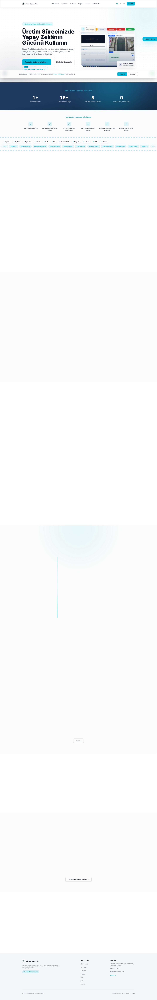
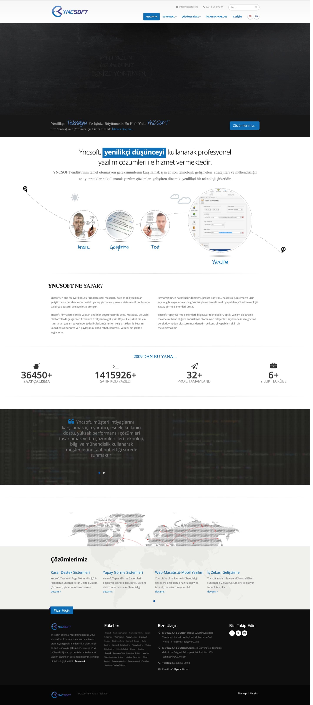
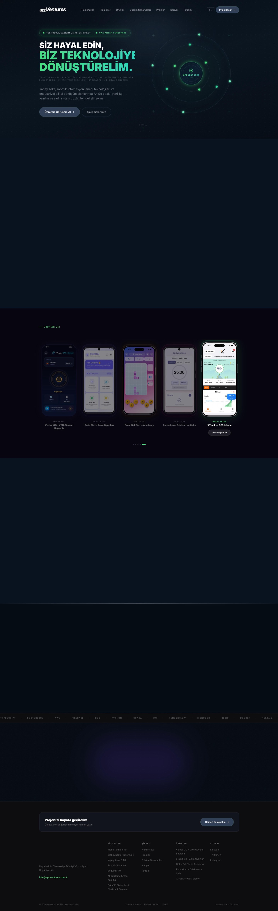
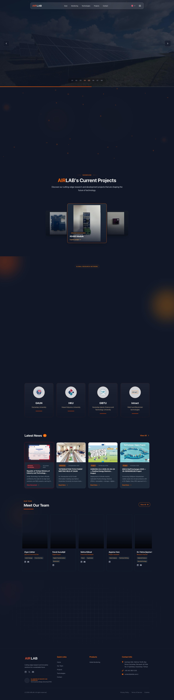
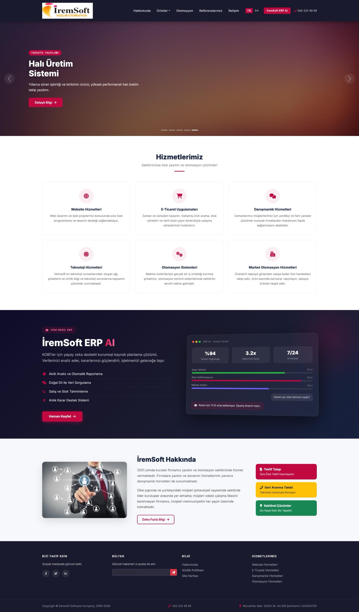
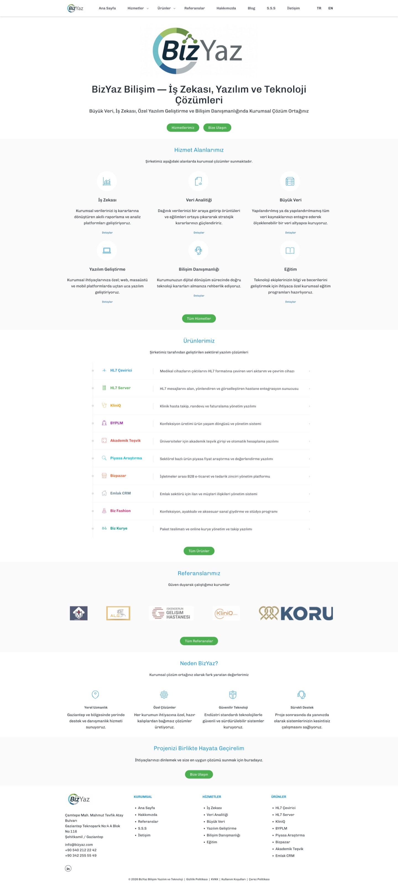
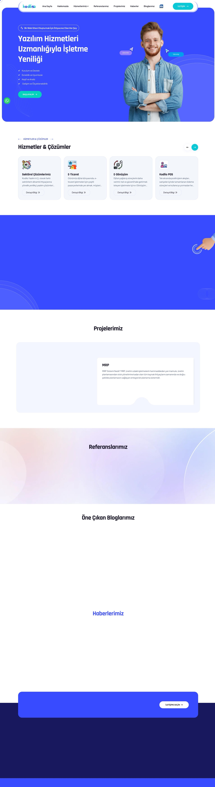
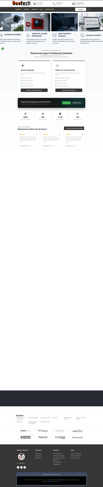

### 8.3 IoT / Gömülü Sistem / Elektronik / Robotik

| # | Firma | Konum | Web | Uzmanlık | Ödül / Destek | Ürünler | Ekip |
|---|---|---|---|---|---|---|---|
| 1 | **Efelyum Elektronik Yazılım** | GAÜN Teknopark 4/A No:203; 2018 | efelyum.com | Elektronik donanım tasarımı + üretimi; IoT/Endüstri 4.0 (NFC, BLE 5.1, enerji hasadı, RFID), RS485/CAN/Modbus, Wi-Fi/GSM. **Gaziantep'te doğrulanmış en güçlü gömülü elektronik tasarım firması.** Kamera yok. | **TÜBİTAK 1507 (1), TÜBİTAK 1707 (1), KOSGEB Ar-Ge & İnovasyon (2), 1 patent, 3 TÜR belgesi, 14 Teknopark projesi; GSO "Gaziantep'in Yıldızları" 2021; EMO plaketleri** (beyan) | Tekstil makineleri için temassız Godet sıcaklık transmitteri, kıvılcım sensörü, SunDancer güneş takip, medikal gaz ölçüm | doğrulanamadı |
| 2 | **Tusmec Karma Robot Teknolojileri A.Ş.** | GAÜN Teknopark 4A/B01 | tusmec.com | Heterojen sürü robotik: TUS ZENITH OMNIBOT AMR (LiDAR, 3D kamera, MQTT/REST, WMS/ERP), forklift AMR, AI filo yönetimi, tarım İHA/İKA (görüntü işleme), dijital ikiz | "39 kazanılan ödül" iddiası **doğrulanamadı** | Beta Elektronik, Aras Dağıtım (testimonial) | doğrulanamadı; A.Ş. |
| 3 | **RİGELSAN** | HKÜ OSB Teknokent, Şehitkamil; 2023 | rigelsan.com | Savunma/güvenlik: fiber optik FPV drone, **UWB duvar/enkaz arkası radar**, termal & sismik sensörlü otonom robot; milli gömülü yazılım/donanım | doğrulanamadı | AFAD için arama-kurtarma aracı | doğrulanamadı |
| 4 | **Özel Otomasyon ve Mühendislik** | Gaziantep OSB 2. Bölge | ozelotomasyon.com.tr | PLC/HMI/SCADA, motor kontrol, pano imalatı, Siemens/Mitsubishi; Veikong solar inverter distribütörü | doğrulanamadı | — | doğrulanamadı |
| 5 | **Alacamaker Yazılım Ar-Ge** | GAÜN Teknopark; 2021 | alacamaker.com (403) | Otopilot sistemleri, haberleşme, sensör yazılımları | doğrulanamadı | — | — |
| 6 | **Mergen Robotics** | GAÜN Teknopark C Blok | mergenrobotics.com (503) | Savunma, havacılık, ileri makine; robotik Ar-Ge | doğrulanamadı | — | — |
| 7 | ArtF4, Robobax, Metsan Elektronik, Revival Elektronik, Aviotech, Seyf Ar-Ge, Arlat Makina | Teknopark kayıtlı | — | Web/otomasyon/STEM eğitimi/elektronik (detay doğrulanamadı) | — | — | — |

**Ekosistem:** Gaziantep Teknopark (GAÜN, 2007): 172 firma. Gaziantep OSB Teknokent (HKÜ, 2017): liste erişilemedi. Model Fabrika (GSO + UNDP): hizmet alan sanayiciler listeleniyor, çözüm sağlayıcı listesi yok. Teknofest'ten yalnızca öğrenci takımları (Mergenya ROV, Zaferay görüntü işlemeli hava savunma).

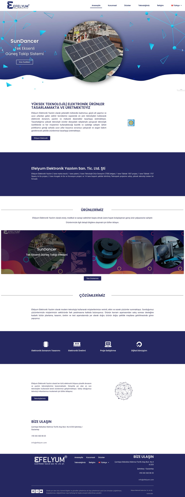
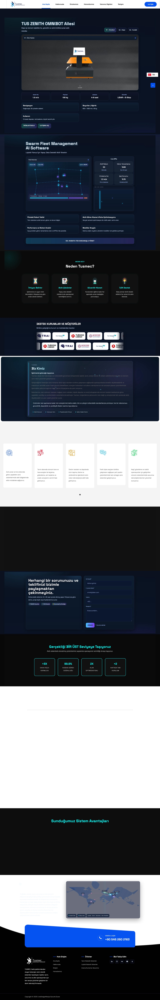
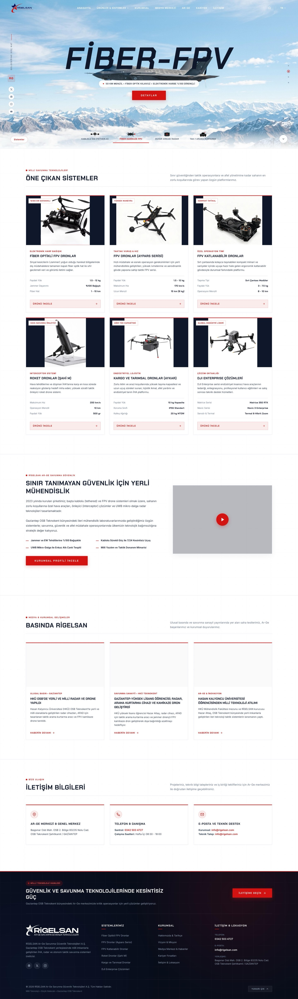

---

## 9. Yurtdışı Benchmark: "360°" Ürün Geliştirme Stüdyoları

Kısaltmalar: T=tasarım, Y=yazılım, D=donanım/gömülü, AI, IoT, K=kamera/görüntü işleme.

| # | Ad | Ülke | Web | Uzmanlık | Ödüller (doğrulanan) | İşler | Ekip | Benchmark özelliği |
|---|---|---|---|---|---|---|---|---|
| 1 | **Cambridge Consultants** (Capgemini) | İngiltere, Cambridge | cambridgeconsultants.com | T, Y, D (gömülü, 5G/RF), AI ("physical AI"), IoT, **K (imaging/vision)** | iF "yeni nesil ürün konsepti" Avrupa #1 (beyan); CES 2026 kısa liste | LEGO SMART Play, Microsoft agentic AI, Netafim | 900+ | Deep tech + tasarım tek çatı; IP üretip devretme; spin-out kültürü |
| 2 | **Delve** (eski Bresslergroup) | ABD, Philadelphia/Boston/Madison | delve.com | T, Y, D (mekanik/elektronik/gömülü), AI/IoT, **K (Lazurite kablosuz cerrahi kamera)** | "200+ ödül, 1.800+ patent" (beyan) | Dexcom, Lazurite, PetSafe | 200+ | Araştırma→tasarım→mühendislik→sertifikasyon zinciri |
| 3 | **Fresh Consulting** | ABD, Seattle (+Bangkok, Meksika) | freshconsulting.com | T, Y, D (robotik), **AI/ML + computer vision**, IoT | doğrulanamadı | Microsoft robotik air-hockey ("physical AI"), adidas giyilebilir, United Rentals robot kontrol | doğrulanamadı | Strateji+tasarım+yazılım+donanım+AI/CV beş sütun tek ajans |
| 4 | **Tomorrow Lab** | ABD, Brooklyn | tomorrow-lab.com | T, D (mekanik/elektrik/**firmware**), IoT, Y | **Good Design 2025 x2, Dieline 2023, Fast Company IBD 2017, IDEA Gold 2016** | Hammerhead bisiklet navigasyonu, Jules AI hoparlör, AdhereTech akıllı ilaç şişesi | küçük ekip | Prototype→Product→Pilot Manufacturing 3 kademeli teklif |
| 5 | **Whipsaw** | ABD, San Francisco | whipsaw.com | T (endüstriyel, marka, dijital UX), D, Y | **IDEA 2026 x2, Red Dot 2026**; "325+ ödül" | IonQ Forte kuantum bilgisayar, Tile, Tonal, Owala | doğrulanamadı | "The Workshop" donanım girişim akseleratörü; Launch/Evolve/Define paketleri |
| 6 | **Smart Design** | ABD, Brooklyn | smartdesignworldwide.com | T, Y, D, AI | **iF 2026, Core77 2026, IDEA 2025, Good Design 2024, Fast Company IBD 2021-23** | Gatorade Gx ter yaması + app ekosistemi, Meta VR güvenlik | doğrulanamadı | Fiziksel ürün + app + veri ekosistemi tek projede; yıl bazlı ödül şeffaflığı |
| 7 | **Teague** | ABD, Seattle (+Münih) | teague.com | T, Y, D (mockup/sistem), AI (otonom) | "300 tasarım ödülü" (beyan); Red Dot 2008 | Shield AI X-BAT, Starlab uzay istasyonu mockup (NASA); Boeing 787, Xbox | ~300 | 100 yıllık çalışan sahipli bağımsız yapı |
| 8 | **fuseproject** | ABD, SF | fuseproject.com | T (endüstriyel, marka, UX), AI/robotik ürün | iF (SFMOMA, TELO), IDEA, National Design Award | ElliQ AI robot, Snoo, Samsung Frame TV | doğrulanamadı | Girişimlerde hisse karşılığı tasarım |
| 9 | **Synapse** (Capgemini) | ABD, Seattle | synapse.com | D (elektrik/mekanik/**firmware**), Y, edge AI, T | doğrulanamadı | Nike FuelBand, Google Jacquard, Compology (kamera tabanlı atık) | "1.500+ proje" | Donanım öncelikli mühendislik evi |
| 10 | **LAYER** | İngiltere, Londra | layerdesign.com | T (endüstriyel, dijital, marka), D (engineering) | **Red Dot Best of the Best 2025, German Design Gold 2025, iF 2019-26, TIME Best Inventions 2022/26** | Bang & Olufsen, Ledger Stax, Viture AR gözlük | 30 | 30 kişiyle 200+ ödül |
| 11 | **Moment Factory** | Kanada, Montreal | momentfactory.com | T (deneyim), Y, D, **AI + computer vision** (etkileşimli kurulum) | Fast Company Most Innovative 2025 | Sphere Las Vegas, Changi Havalimanı, Billie Eilish turnesi | ~400 | Kendi IP'si (Lumina) + müşteri işi |
| 12 | **Manyone** | Danimarka (+14 lokasyon, Tel Aviv dahil) | manyone.com | T (marka, servis, endüstriyel+engineering, mekânsal), Y, AI | doğrulanamadı | Volvo, Novo Nordisk, Lufthansa, Samsung | 250 | 7 yılda 14 şehir "boutique network" |
| 13 | **Bakken & Bæck** | Norveç (+Amsterdam, Londra, Barselona) | bakkenbaeck.com | T, Y (full-stack), AI entegrasyonu | doğrulanamadı | Google DeepMind, Coinbase, Stripe, IKEA | 60+ | "Strategy, design, code" tek çatı; %100 kurucu sahipli |
| 14 | **ustwo** | İngiltere, Londra (+Malmö, Lizbon, NY) | ustwo.com | T, Y, AI, oyun | **Apple Design Award 2014** (Monument Valley); B Corp | Monument Valley, RVO Health AI koç, Google/DeepMind | ~260 | Ajans + kendi IP'si çift model |
| 15 | **TTP** | İngiltere, Cambridge | ttp.com | D, Y, AI, **K (imaging & optics)**, üretim | doğrulanamadı | Serac Imaging, Viasat, Terrestar 5G | doğrulanamadı | Görüntüleme/optik + gömülü + üretim tek kampüs |
| 16 | **Design Partners** (PA Consulting) | İrlanda | designpartners.com | T, D (elektro-mekanik), giyilebilir | **70+ Red Dot, 90+ iF, 80+ Good Design, CES Best of Innovations** | Logitech MX Vertical, Honeywell gaz dedektörleri | doğrulanamadı | Ergonomi/giyilebilir ihtisası |
| 17 | **KISKA** | Avusturya, Salzburg | kiska.com | T (marka, endüstriyel, UX), 3D | **Red Dot 2026 x4, UX Design Award 2026** | KTM (30 yıl), Loxone akıllı ev | doğrulanamadı | Marka + ürün + araç içi UX tek müşteride |
| 18 | **Seymourpowell** | İngiltere | seymourpowell.com | T (endüstriyel, ulaşım, dijital) | 116 ödül: D&AD x9, iF x9, Red Dot BoB | Virgin Galactic kabin, Boeing, Samsung | doğrulanamadı | Foresight & Strategy birimi |
| 19 | **PDD** | İngiltere | pddinnovation.com | T, D, Y, AI; **ISO 13485** | — | Merck easypod, PitPat | doğrulanamadı | Medikal sertifikalı tasarım+mühendislik |
| 20 | **Zühlke** | İsviçre (+global) | zuehlke.com | Y, D (hardware engineering), AI, deneyim tasarımı | — | NHS COVID app, HSBC mobil | doğrulanamadı | Düzenlenmiş sektörlerde yazılım+donanım |
| 21 | **Tellart** | Hollanda | tellart.com | T (deneyim), Y, D (kurulum) | Cannes, SXSW, One Show (yıl doğrulanamadı) | Expo 2020 BAE, Expo 2025 Hollanda, Google Chrome Web Lab | doğrulanamadı | Expo ölçeğinde deneyim |
| 22 | **Random Studio** | Hollanda | random.studio | T (mekânsal/interaktif), Y, D, AI; B Corp | — | Moncler, Nike Centre Pompidou, Jacquemus, Glossier AI | doğrulanamadı | Lüks/moda fiziksel+dijital |
| 23 | **DEPT** | Hollanda/Global | dept.global | T, Y, AI ("agentic engineering") | **Webby Agency of the Year 2022-24**, Gartner MQ Leader 2026 | NVIDIA işaret dili, eBay, Arm | 4.000 | Deptify kendi AI platformu |
| 24 | **frog** (Capgemini Invent) | ABD/global | frog.co | T, Y, D, AI, VR | Time Design of the Year 1984 | Nome physical AI robot, Disney MagicBand | 2.000+ | Tasarım → strateji+teknoloji evrimi |
| 25 | **IDEO** | ABD/global | ideo.com | T, AI entegrasyonu, strateji | — | Boom Supersonic, Eli Lilly, Sephora | 500+ | Design thinking metodolojisini ürünleştirme |

**Ek (dijital ağırlıklı):** Work & Co (Cannes Lions Gold 2021, Webby), Monks (23 Cannes Lions, Peabody 2022), Huge, Designit, Method, argodesign, Reaktor, Takram (Japonya, design engineering), BKID (Kore, robotik/giyilebilir).

**Kamera/video-AI ürün şirketleri (ajans değil):** icetana (Avustralya, ASX), Vaxtor (İngiltere, ANPR/OCR, Axis ortağı), Evercam (İrlanda, doğrulanamadı).

**Durum notları:** Bresslergroup → Delve; MindTribe → Accenture Industry X; Cooper Perkins ve Design Partners → PA Consulting; Fjord → Accenture Song; Kin ve BERG kapandı; Very → itamg.com; Nomad Studio (Kopenhag) doğrulanamadı (muhtemelen Manyone kastediliyor).

### Türkiye'deki bir ajans için 5 benchmark çıkarımı
1. **Ödül şeffaflığı:** Smart Design, LAYER, Tomorrow Lab yıl+kurum+ürün bazlı ödül sayfası tutuyor. Türk ajanslarının çoğu tutmuyor.
2. **Kademeli hizmet paketleri:** Tomorrow Lab (Prototype→Product→Pilot) ve Whipsaw (Launch/Evolve/Define) kapsam belirsizliğini azaltıyor.
3. **Girişim akseleratörü / IP modeli:** Whipsaw "The Workshop", fuseproject hisse modeli, Cambridge Consultants spin-out.
4. **Sertifikalı mühendislik:** PDD ISO 13485, TTP/Cambridge görüntüleme laboratuvarları; kamera/AI ürünleri için "ajans"tan "ürün geliştirme evi"ne geçiş eşiği.
5. **Kendi IP'si olan ajans:** ustwo (Monument Valley), Moment Factory (Lumina), DEPT (Deptify).

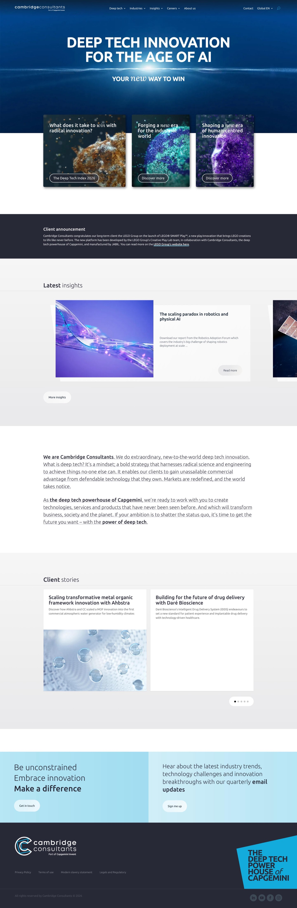
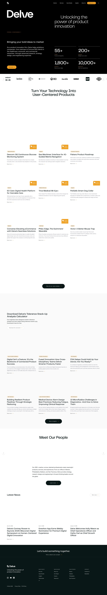

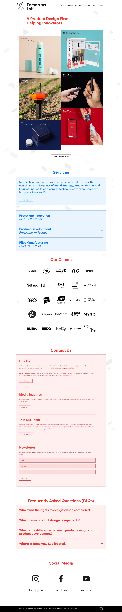
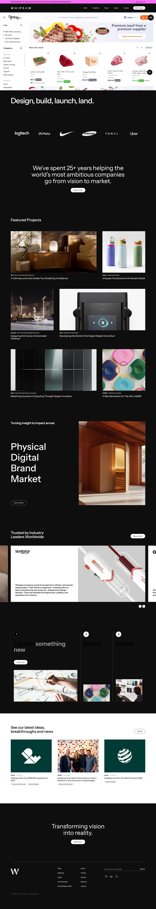
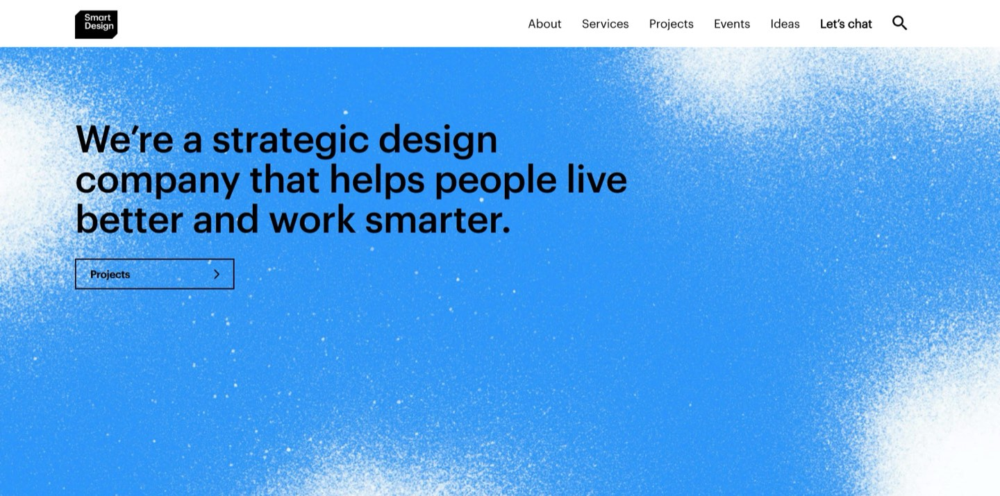
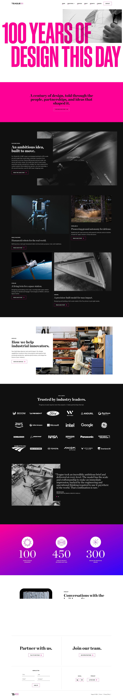
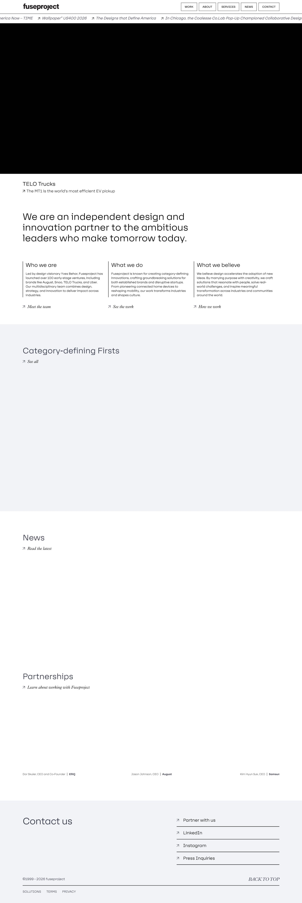
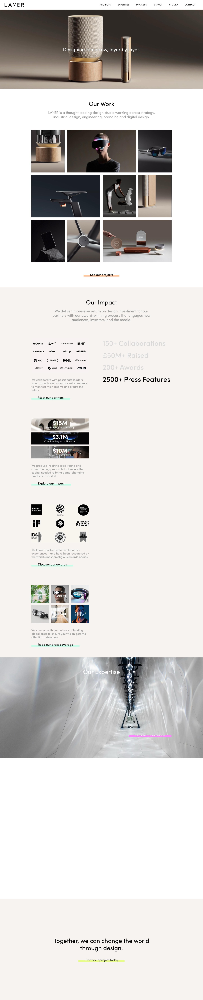
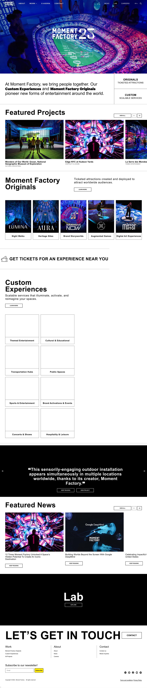
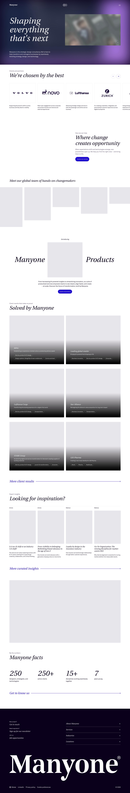
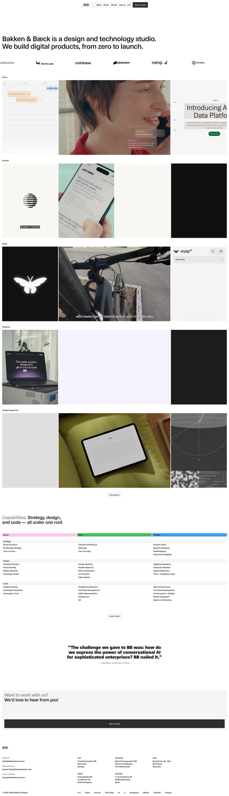
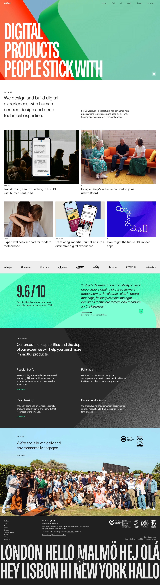

---

## 10. Ödül Listelerinden Çıkan Gerçekler

- **Awwwards Türkiye:** Türkiye profillerinden hiç Site of the Day yok. En yüksek Super Agency 14 Honorable Mention; Fol 4, Hostamedia 2, Istcode 1.
- **Altın Örümcek 2025 (23.):** Web → Fol; Mobil → Commencis (Pegasus); AI & Teknoloji → Istcode 1., Scope Digital 2.; Kreatif Ajans → Scope 1., Super Agency 2., Salt İletişim 3.; Bankacılık → MagiClick (Akbank). 2024: Web → FRANK (İşportföy), Mobil → Commencis.
- **Kristal Elma / Felis / MIXX:** Kazananlar büyük reklam ajansları (Tribal Worldwide, Ogilvy 4129, TBWA, VML, Rafineri, Concept). Dijital ürün/UX stüdyosu neredeyse yok; teknoloji ortakları (Kodegon, Capsule Works, Jaguar Projects, fam°) katkı sağlayan olarak geçiyor.
- **Red Dot / iF (ajans bazında):** Sherpa (Red Dot 2018 x3, iF 2019), Ouchhh (Red Dot 2017/2019), Kilit Taşı, Arman (iF 2022 x3), Kar Design (iF 2024), Ekin (Red Dot, iF). iF 2024'te 37 Türk şirketi ödül aldı (çoğu ürün tasarımı).
- **Deloitte Fast 50 TR 2025:** Liste fintech/SaaS/oyun ağırlıklı; tasarım+yazılım ajansı profiline uyan yok. 2024: Norm Digital 9.
- **Bilişim 500:** Güvenlik kamera entegratörü 2025 → Securitas Technology; 2026 → İSBAK. Ekin 2018 Yazılım İhracatı Şampiyonu.
- **Stevie:** GTech IBA 2026 (1 Gold, 2 Silver, 1 Bronze), Harikalar IBA 2021 (Gold + Bronze), Sherpa Bronze 2019.
- **Apple Design Awards:** Türkiye'den yalnızca MobGe (Oddmar, 2018).
- **Cannes Lions / D&AD:** Türk deneyim/ürün stüdyosu ödülü yok; 4129Grey 2018 Gold (Amnesty).

---

## 11. Ekran Görüntüsü Alınamayan Siteler
- **sherpa.digital** — SSL/cipher hatası (site TLS'i bozuk; Paribu bünyesine geçtiği için bakımsız olabilir)
- **scope.digital** — zaman aşımı
- **demmuseums.com** — yalnızca başlık döndürüyor
- **3yteknoloji.com.tr**, **alacamaker.com** — 403
- **mergenrobotics.com** — 503
- **kibrit.com.tr** — SSL süresi dolmuş
- **wandadigital.com**, **odakguvenlik.com**, **movita.com.tr** ve diğer ikincil adaylar — kapsam nedeniyle alınmadı

Tam sayfa limitini aşan sitelerde (Super Agency, Penta Yazılım, Develcodex, Fikir Sanat Medya) yalnızca ilk ekran alındı.

---

## 12. Kaynaklar (seçme)

**Ödül listeleri:** awwwards.com/winner-list/Turkey · altinorumcek.com/2025/sonuclar · kristalelma.org.tr kazanan PDF'leri (2020, 2022, 2023, 2025) · mixxawards-tr.org/kazananlar-listesi · felisodulleri.com · bilisim500.com · competition.adesignaward.com (Türkiye sıralaması) · tech.stevieawards.com · odulhokkabazi.com

**Dizinler:** clutch.co/tr (developers, app-developers, ui-ux, product-design) · gaziantepteknopark.com.tr/firma-rehberi · sahaistanbul.org.tr · edvido.com · dijitalajanslar.com · bigumigu.com (deneyim tasarımı ajansları) · designweekturkiye.com/tasarim-ofisleri

**Haber/doğrulama:** webrazzi.com (MIXX 2025) · euronews (Dem Müzecilik MUSE 2024) · kultur.istanbul (Project Istanbul MUSE) · capital.com.tr (iF 2024) · defencetoday.com.tr (Securitas Bilişim 500) · rayhaber.com (İSBAK Bilişim 500 2026) · haberege.com.tr (GTech Stevie) · egirisim.com (Udentify/REM) · gapgundemi.com (AIRLAB) · babahaber.com (TÜBİTAK 1512 taş kesim) · eng.gantep.edu.tr

**Ajans siteleri:** Her bölümde web sütununda listelenmiştir.
